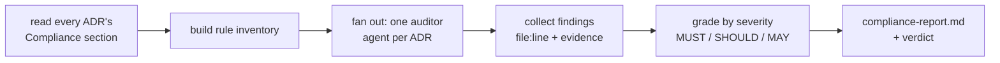

# Doc Compliance

This skill keeps the code honest against the architecture decisions. The ADRs in
`docs/engineering/` are normative: each ends with a **Compliance** section of
`MUST` / `SHOULD` / `MAY` rules. This skill extracts those rules and audits the
codebase against them with a team of agents.

## Procedure

### 1. Load the rules

- List the ADRs: every `docs/engineering/0*.md` file.
- Read each one and extract its **Compliance** section. Each bullet is a rule.
  Record, per rule: the ADR id, the rule text, and its strength
  (`MUST`/`MUST NOT` = blocking, `SHOULD` = warning, `MAY` = informational).
- Build the rule inventory before touching code. If `docs/engineering/` has no
  ADRs, stop and say so.

### 2. Scope the code

- Find the Go source: `cmd/`, `internal/`, `*.go`. 
- **If there is no Go code yet**, do not invent findings. Report that the ADRs
  are in place and there is nothing to audit yet, list the rule inventory as the
  checklist future code will be held to, and stop.

### 3. Dispatch the audit team (parallel)

Launch **one auditor agent per ADR** (group small/related ADRs together if it
keeps each agent focused). Send them in a single message so they run
concurrently. Give each auditor:

- The repo path and the specific ADR file it owns.
- Its extracted Compliance rules.
- This instruction:

  > You are auditing the simple-llm-router Go codebase against ADR-XXXX. For each
  > Compliance rule, determine whether the code complies. Prefer mechanical
  > checks where possible, then read the relevant code to confirm. For every
  > violation report: the rule, severity (MUST/SHOULD), the offending
  > `file:line`, a short quote of the code, and a concrete fix. Do not report a
  > violation you cannot point to in the code — no speculation. Also list rules
  > that are clearly satisfied. Return structured findings only.

#### Mechanical checks the auditors should run (examples)

These map directly to greppable rules — use them as starting evidence, then read
context to avoid false positives:

| Rule (ADR) | Check |
|------------|-------|
| No mutexes (0015) | `grep -rn "sync.Mutex\|sync.RWMutex" --include=*.go` → any hit is a MUST-NOT violation |
| Stdlib-only deps (0015) | inspect `go.mod` require block; flag anything outside the sanctioned list (`gopkg.in/yaml.v3`) |
| Context propagation (0003/0015) | request-path funcs missing a leading `ctx context.Context` param |
| No panic in request path (0015) | `grep -rn "panic(" --include=*.go` in `internal/server`, `internal/router`, `internal/backend` |
| Layering (0003) | `internal/backend` or `internal/router` importing `internal/server`; `internal/model` importing any internal pkg |
| No engine branching (0002) | `grep -rn "owned_by\|vllm\|sglang" --include=*.go` used to alter behavior |
| Passthrough fidelity (0001) | response decoded into a struct without a raw catch-all; `plugins` forwarded upstream |
| Lock-free health snapshot (0005) | health state guarded by a mutex instead of `atomic.Value`/channel |
| No secrets logged (0009/0011) | credentials/tokens passed to log calls |
| Tests with -race & fakes (0012) | presence of `_test.go`, `httptest`, fake `Backend` impls |

### 4. Aggregate

Collect all auditors' findings and produce a report:

- A summary table: ADR · rules checked · MUST violations · SHOULD violations · pass.
- A detailed list of violations grouped by severity (MUST first), each with
  `file:line`, the rule, the evidence quote, and the fix.
- An overall verdict: **COMPLIANT** (no MUST violations) or **NON-COMPLIANT**.

Write the report to `docs/engineering/compliance-report.md` and also summarize the
verdict and top issues in the chat reply.

### 5. Offer next steps

If there are MUST violations, offer to fix them or open issues. If a violation is
actually the ADR being wrong/outdated, flag it — the fix may be to **update the
ADR**, not the code (the docs lead; see `docs/engineering/README.md`).

## Principles for this skill

- **Evidence over opinion.** Every violation cites `file:line` and quotes code.
- **No false positives.** When unsure, read more code before flagging.
- **Docs are the source of truth.** Audit against the ADRs as written; if a rule
  seems wrong, surface it rather than silently ignoring it.
