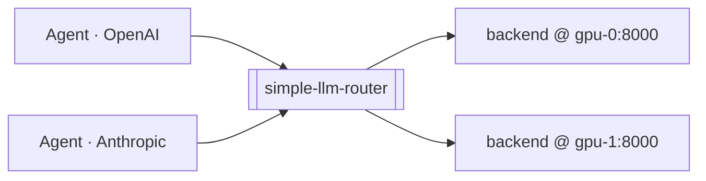

# simple-llm-router

A small, fast router that gives agents a **single, stable endpoint** in front of a
changing fleet of local inference servers ([vLLM](https://docs.vllm.ai/),
[SGLang](https://github.com/sgl-project/sglang), or anything OpenAI-compatible).
Agents ask for a model by name; the router resolves it, picks a healthy backend,
and proxies the request — speaking both the **OpenAI** and **Anthropic** APIs on
either edge.



## Why

- **One endpoint, many models.** Agents use a stable alias (`north`, `smart`, …);
  the router knows which backend serves it, so the fleet can change underneath.
- **Multi-protocol.** Accepts OpenAI (`/v1/chat/completions`) and Anthropic
  (`/v1/messages`) as a consumer, and talks to OpenAI- or Anthropic-shaped
  backends as a provider — translating only when it must.
- **Transparent.** A passthrough proxy that preserves non-standard fields
  (`reasoning_content`, usage extras, multimodal content) byte-for-byte.
- **Smart routing.** Health-aware round-robin with failover, plus opt-in
  **pareto** (cheapest-good-enough) and **fusion** (panel → judge → synthesis).
- **Boring on purpose.** Standard-library-first (one dependency: YAML),
  lock-free, easy to read and easy to operate.

## Download

Prebuilt binaries for **Linux, macOS, and Windows** (amd64 + arm64) are attached
to every [GitHub Release](https://github.com/mattbucci/simple-llm-router/releases).
Grab the archive for your platform, unpack it, and run `router` — there is no
runtime to install (each binary is a single static, dependency-free executable):

```bash
# Linux/macOS — pick the asset matching your OS/arch
curl -fsSL -o router.tar.gz \
  https://github.com/mattbucci/simple-llm-router/releases/latest/download/simple-llm-router_<version>_<os>_<arch>.tar.gz
tar -xzf router.tar.gz                 # extracts: router, README.md, LICENSE, config.example.yaml
./router --version
```

On Windows, download the `..._windows_amd64.zip` asset, unzip it, and run
`router.exe`. Each release also ships a `checksums.txt` for verification. Prefer
to build from source? See the Quickstart below.

## Quickstart

```bash
# 1. Build (or download a prebuilt binary — see "Download" above)
go build -o bin/router ./cmd/router

# 2. Configure (copy the template, edit backends + aliases)
cp config.example.yaml config.yaml

# 3. Run
./bin/router --config config.yaml

# 4. Call it like the OpenAI API — using a friendly alias
curl http://localhost:8080/v1/chat/completions \
  -H 'Content-Type: application/json' \
  -d '{"model":"north","messages":[{"role":"user","content":"hello"}]}'
```

Streaming (`"stream": true`), multimodal content arrays, and the Anthropic
`/v1/messages` endpoint work the same way. Operational endpoints: `/healthz`,
`/readyz`, `/metrics` (Prometheus text), and `/v1/models`.

## Setup

The router is configured by a **single YAML file** passed with `--config` (copy
`config.example.yaml` to start). It is loaded once and fully validated before the
server listens, so a bad config fails fast with a clear message.

**Backends and aliases live in the YAML** — not in environment variables:

```yaml
listen: ":8080"
backends:
  - name: gpu-0
    base_url: http://gpu-0:8000/v1         # any OpenAI-compatible server
  - name: gpu-1
    base_url: http://gpu-1:8000/v1
aliases:
  north:                                    # stable name agents ask for
    model: /models/North-Mini-Code-1.0-fp8  # upstream id to rewrite to
    backends: [gpu-0]
```

**Secrets use `${ENV}` interpolation.** Any `${VAR}` in the YAML is replaced with
that environment variable when the config loads (unset → empty), so the committed
file holds placeholders, never literal secrets:

```yaml
auth:
  tokens: [ ${ROUTER_API_KEY} ]                       # inbound API key(s)
backends:
  - name: anthropic-host
    base_url: https://host/v1
    protocol: anthropic
    credentials: { api_key: ${ANTHROPIC_HOST_KEY} }   # outbound provider key
```

The router does **not** auto-load a `.env` file — `${VAR}` reads the *process*
environment. Supply secrets inline, or `source` a `.env` yourself first:

```bash
ROUTER_API_KEY=sk-... ./bin/router --config config.yaml      # inline
# or, loading a .env (which the router never reads on its own):
set -a; source .env; set +a && ./bin/router --config config.yaml
```

`config.local.yaml`, `*.local.yaml`, and `.env` are gitignored — keep
environment-specific values and secrets out of git. Full reference (aliases,
`pareto`/`fusion`, auth, timeouts):
[docs/engineering/0010-configuration.md](docs/engineering/0010-configuration.md).

## Audio (TTS, transcription & cloud audio)

The router can also front an **audio gateway** — text-to-speech, transcription,
voice management, plus ElevenLabs audio-isolation, sound-effects, and music — as a
transparent passthrough running parallel to the chat router
([ADR-0022](docs/engineering/0022-audio-passthrough.md)). Point the optional
`audio:` block at the gateway:

```yaml
audio:
  base_url: http://192.168.2.179:8653/v1
  credentials: { api_key: ${VOICE_API_TOKEN} }
```

Requests and responses are forwarded byte-for-byte and streamed, so binary audio,
chunked output, and large multipart uploads (incl. mp4) pass through unmodified.
The gateway handles engine selection (`auto`/`local`/`elevenlabs`), ffmpeg
transcoding, and cloud fallback; the router just gives it a stable endpoint:

```bash
# register a voice
curl http://localhost:8080/v1/voices -H 'Content-Type: application/json' \
  -d '{"name":"anna","description":"bright energetic young female podcast host"}'
# speak (binary audio round-trips through the router)
curl http://localhost:8080/v1/audio/speech -H 'Content-Type: application/json' \
  -d '{"input":"Hello world","voice":"anna","response_format":"wav"}' -o hi.wav
# transcribe anything (incl. mp4)
curl http://localhost:8080/v1/audio/transcriptions -F file=@meeting.mp4 -F response_format=srt
# clean a clip / make a sound effect / generate music (ElevenLabs)
curl http://localhost:8080/v1/audio/isolation -F file=@episode.mp3 -o clean.mp3
curl http://localhost:8080/v1/sound-effects -H 'Content-Type: application/json' \
  -d '{"text":"distant thunder, light rain","duration_seconds":5}' -o thunder.mp3
curl http://localhost:8080/v1/music -H 'Content-Type: application/json' \
  -d '{"prompt":"calm lo-fi piano loop","music_length_ms":15000}' -o loop.mp3
```

Proxied paths: `POST /v1/audio/{speech,transcriptions,isolation}`,
`POST /v1/sound-effects`, `POST /v1/music`, and the `/v1/voices` subtree
(list/register/delete). With no `base_url` the audio endpoints `404`. The gateway
is **not** a chat backend: it is not health-probed via `/v1/models` and does not
affect `/readyz`, and its own `/v1/models`/`/healthz` are not proxied. Inbound auth
(`auth.tokens`) applies the same as for chat.

## Repository layout

```
cmd/router/             program entrypoint (composition root, wiring only)
internal/model/         domain types & errors (no I/O)
internal/config/        YAML config loading + validation
internal/backend/       OpenAI/Anthropic client + health/discovery loop
internal/router/        resolution, selection, failover, pareto, fusion
internal/server/        HTTP transport, edge adapters, SSE, auth
internal/observability/ slog logging + Prometheus metrics
docs/engineering/       Architecture Decision Records (ADRs)
evals/                  uv-based API evals + opencode harness
.claude/skills/         the engineering-audit skill
```

## Documentation

The [`docs/engineering/`](docs/engineering/) directory holds the project's
**Architecture Decision Records** — one decision per file, each ending in
normative **Compliance** rules. Start with the
[ADR index](docs/engineering/README.md). A few entry points:

- [ADR-0001 — Transparent OpenAI passthrough](docs/engineering/0001-transparent-openai-passthrough.md)
- [ADR-0006 — Routing, selection & failover](docs/engineering/0006-routing-and-failover.md)
- [ADR-0013 — Pareto routing](docs/engineering/0013-pareto-routing.md) ·
  [ADR-0014 — Fusion routing](docs/engineering/0014-fusion-routing.md)
- [ADR-0016 — Multi-protocol consumers & providers](docs/engineering/0016-multi-protocol.md)
- [ADR-0022 — Audio passthrough (TTS & transcription)](docs/engineering/0022-audio-passthrough.md)

The [`/engineering-audit`](.claude/skills/engineering-audit/SKILL.md) skill reads
the Compliance rules and dispatches a team of agents to check the code against them.

## Testing

```bash
go test -race ./...            # unit + handler tests, no GPU needed
uv run evals/run_evals.py      # behavioral evals against a running router
./evals/opencode_smoke.sh      # drive the router with the opencode agent
```

See [`evals/README.md`](evals/README.md).

## Related projects

The router sits between **inference providers** (the backends it proxies to) and
**consumers** (the agents that call it):

**Inference providers** — SGLang serving setups the router can front:

- [2x-R9700-RDNA4-GFX1201-sglang-inference](https://github.com/mattbucci/2x-R9700-RDNA4-GFX1201-sglang-inference)
  — dual AMD R9700 (RDNA4 / gfx1201).
- [2x-3090-GA102-300-A1-sglang-inference](https://github.com/mattbucci/2x-3090-GA102-300-A1-sglang-inference)
  — dual NVIDIA RTX 3090 (GA102).
- [m4-sglang-inference](https://github.com/mattbucci/m4-sglang-inference)
  — Apple M4.

**Consumers** — agents that call the router's stable endpoint:

- [agent-sandbox](https://github.com/mattbucci/agent-sandbox) — agent harness
  that drives the router.

## License

[MIT](LICENSE) © 2026 Matthew Bucci
