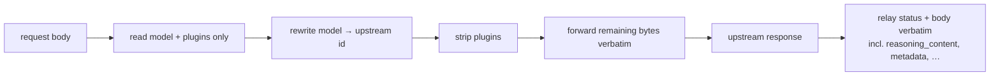

# ADR-0001: Transparent OpenAI-compatible passthrough

- **Status:** Accepted
- **Date:** 2026-06-28
- **Deciders:** Matthew Bucci

## Context

Agents already speak the OpenAI API. The backends on the fleet
(vLLM, SGLang) also speak the OpenAI API — and they return **non-standard
fields** on top of it. Observed live on the fleet:

```jsonc
// gpu-0, model North-Mini-Code-1.0-fp8 (a reasoning model)
{
  "choices": [{ "message": {
      "content": "",
      "reasoning_content": "The user asks: ...",   // non-standard
      "tool_calls": null } }],
  "usage": { "completion_tokens": 30,
             "reasoning_tokens": 30,                // non-standard
             "prompt_tokens_details": null },
  "metadata": { "weight_version": "default" },      // non-standard
  "matched_stop": null                              // non-standard
}
```

If the router deserializes into a fixed struct and re-serializes, it will
**silently drop** `reasoning_content`, `reasoning_tokens`, `matched_stop`, and
`metadata` — corrupting responses for reasoning models and any future field a
backend adds.

## Decision

The router is a **transparent proxy** of the OpenAI HTTP contract. It does not
own the schema of request or response bodies.



- Bodies are treated as **opaque** except for the few fields the router must
  read or rewrite: `model`, `stream` (to pick the response path), and a small,
  reserved set of **routing-control fields** (see below).
- The router reads only what it needs, **rewrites only `model`**, **consumes and
  strips its routing-control fields**, and forwards the rest of the bytes
  unchanged in both directions.

### Routing-control fields

Some strategies ([ADR-0006](0006-routing-and-failover.md),
[ADR-0013](0013-pareto-routing.md), [ADR-0014](0014-fusion-routing.md)) need
per-request directives. Following OpenRouter's convention these live under a
top-level **`plugins`** array (and nowhere else). These are **router inputs, not
part of the upstream request**: the router reads them and **removes them from the
body before forwarding**, so backends never see them.

Where partial decoding is needed, use a representation that preserves unknown
fields (e.g. decode into a struct for known fields plus a raw-JSON catch-all, or
operate on the raw bytes and patch only `model`). Never round-trip a body
through a lossy struct.

### Scope: same-protocol vs cross-protocol

This transparency applies on the **same-protocol path** — when the consumer and
the chosen provider speak the same API shape (OpenAI→OpenAI, Anthropic→Anthropic).
When they differ, the router must **translate** through a canonical model and
full byte-fidelity is impossible; that case is governed by
[ADR-0016](0016-multi-protocol.md). On the `round_robin` and direct-id paths the
router prefers a same-protocol backend when one supports the consumer's protocol,
precisely to keep this fidelity. The `pareto` selector is the exception: its cost
order is authoritative ([ADR-0013](0013-pareto-routing.md)), so the router skips
the same-protocol reordering there rather than promote a costlier same-protocol
candidate ahead of the cheapest one.

## Consequences

**Positive**
- New upstream fields work on day one; reasoning models are not corrupted.
- The router stays tiny and engine-agnostic ([ADR-0002](0002-engine-agnostic-backends.md)).

**Negative / trade-offs**
- The router cannot deeply validate request bodies; malformed requests are the
  backend's to reject (the router maps the resulting status — see
  [ADR-0006](0006-routing-and-failover.md)).
- "Rewrite only `model`" means body editing must be surgical, not a full
  re-encode.

## Compliance

- **MUST NOT** round-trip request or response bodies through a struct that
  discards unknown JSON fields.
- **MUST** preserve `reasoning_content`, `reasoning_tokens`, `metadata`,
  `matched_stop`, and any other unrecognized fields verbatim.
- **MUST** rewrite only the `model` field on the outbound request, and **MUST**
  strip the reserved `plugins` routing-control field so no backend ever receives
  it; no other body field may be added, removed, or reordered semantically.
- **MUST** relay the upstream HTTP status code and body `Content-Type` to the
  client.
- **SHOULD** have a test that sends an unknown response field through the router
  and asserts it survives.
