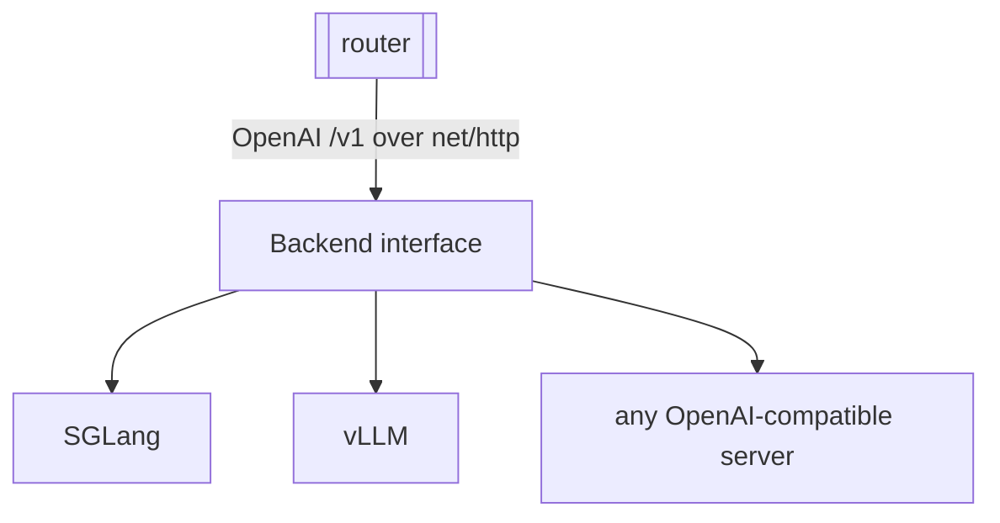

# ADR-0002: Engine-agnostic backends over the OpenAI `/v1` protocol

- **Status:** Accepted
- **Date:** 2026-06-28
- **Deciders:** Matthew Bucci

## Context

The fleet is heterogeneous. Both development backends are currently **SGLang**,
not vLLM:

```jsonc
// GET /v1/models on both hosts
{ "data": [{ "id": "...", "owned_by": "sglang", "max_model_len": 262144 }] }
```

Tomorrow a host may run vLLM, TGI, llama.cpp's server, or another engine.
They all converge on the same OpenAI `/v1` HTTP surface but differ in headers,
extra fields, and quirks. Coupling the router to any one engine's SDK or
behavior would make the fleet brittle.

## Decision

A **backend is defined solely by its OpenAI-compatible `/v1` base URL.** The
router talks the OpenAI HTTP protocol over `net/http` and assumes nothing about
the engine behind it.

- No engine-specific SDKs, no `if engine == "vllm"` branches.
- The only required upstream capabilities are `GET /v1/models` (for discovery
  and health, [ADR-0005](0005-backend-discovery-and-health.md)) and
  `POST /v1/chat/completions`.
- `owned_by`, `metadata.weight_version`, and similar fields are informational and
  treated as opaque ([ADR-0001](0001-transparent-openai-passthrough.md)).



The backend is consumed through an interface owned by the router
([ADR-0003](0003-layered-architecture.md)), so the concrete HTTP client is
swappable and fakeable in tests.

## Consequences

**Positive**
- Mixed fleets (SGLang + vLLM) work uniformly.
- Minimal dependencies; `net/http` is enough.

**Negative / trade-offs**
- Cannot exploit engine-specific features (e.g. vLLM-only endpoints) without a
  new, explicit decision.
- Behavioral quirks between engines surface as upstream errors the router must
  map rather than prevent.

## Compliance

- **MUST NOT** import or depend on any engine-specific client library.
- **MUST NOT** branch on engine type (`owned_by`, server header, etc.) to change
  routing or proxy behavior.
- **MUST** treat a backend as configured by base URL alone.
- **MUST** rely only on `GET /v1/models` and `POST /v1/chat/completions` as
  required upstream endpoints.
