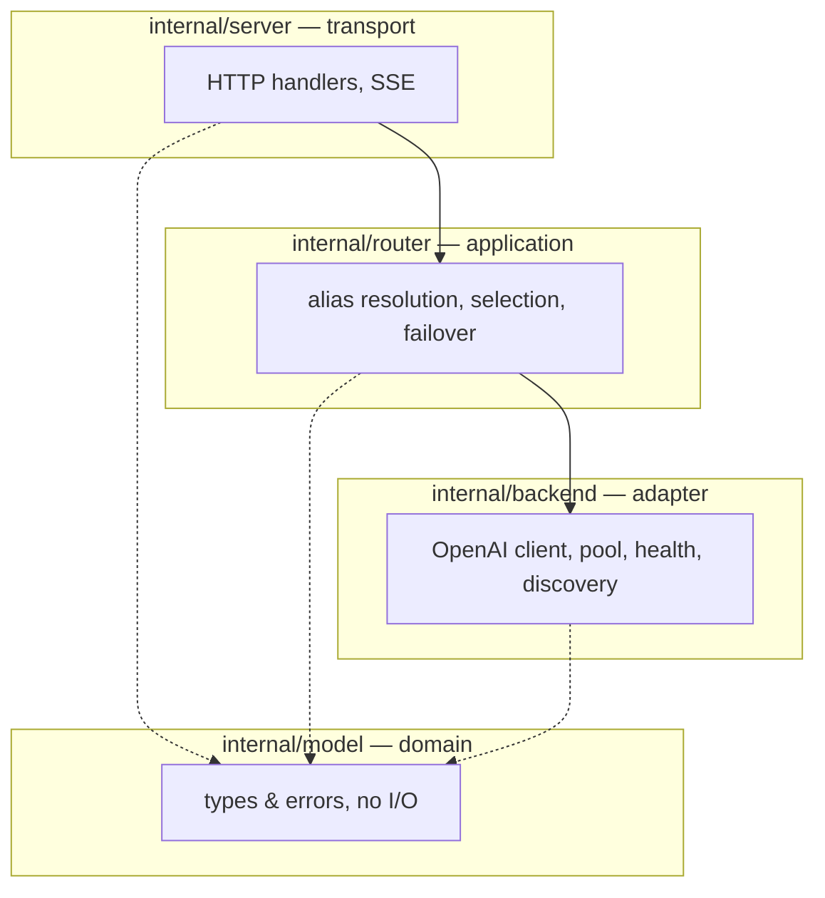

# ADR-0003: Clean layered architecture & the dependency rule

- **Status:** Accepted
- **Date:** 2026-06-28
- **Deciders:** Matthew Bucci

## Context

A router is small but has clear seams: HTTP handling, routing policy, talking to
upstreams, config, and observability. Without a structural rule these blur
together — handlers reach into HTTP clients, routing logic learns about SSE
framing — and the code becomes untestable without a live GPU.

## Decision

Adopt **clean, inward-pointing layers**. Source dependencies point only toward
the center; the domain knows nothing about transport, config, or engines.

| Package | Layer | May import |
|---------|-------|------------|
| `internal/model` | Domain | stdlib only |
| `internal/router` | Application | `model` |
| `internal/backend` | Adapter (outbound) | `model` |
| `internal/server` | Adapter (inbound) | `model`, `router`, `observability` |
| `internal/config` | Cross-cutting | `model` |
| `internal/observability` | Cross-cutting | stdlib only |
| `cmd/router` | Composition root | all |

Cross-layer calls go through **interfaces owned by the consumer** (e.g. the
router defines the `Backend` interface it needs; `internal/backend` implements
it). Only `cmd/router` constructs concrete types and wires them — the
composition root. Every request carries a `context.Context` across layers.

## Consequences

**Positive**
- Each layer is unit-testable with fakes; no GPU needed
  ([ADR-0012](0012-testing.md)).
- Policy changes (routing) don't ripple into transport or clients.

**Negative / trade-offs**
- More interfaces and indirection than a single-file proxy.
- Discipline required: it is easy to "just import" the wrong way.

## Compliance

- **MUST** keep dependencies pointing inward: `server → router → backend → model`.
- **MUST NOT** let `internal/model` import any other internal package.
- **MUST NOT** let `internal/backend` or `internal/router` import
  `internal/server`.
- **MUST** define cross-layer collaborators as interfaces in the consuming
  package.
- **MUST** construct and wire concrete implementations only in `cmd/router`.
- **MUST** thread `context.Context` as the first parameter through request-path
  functions.
