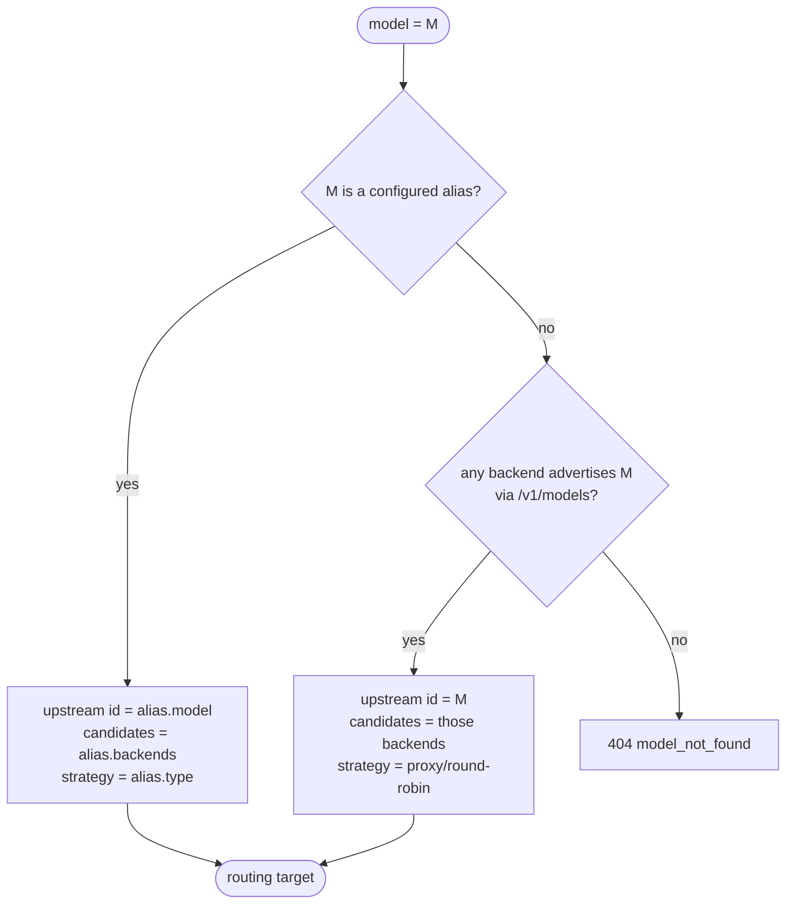

# ADR-0004: Friendly model aliasing & name resolution

- **Status:** Accepted
- **Date:** 2026-06-28
- **Deciders:** Matthew Bucci

## Context

Upstream model ids are neither friendly nor stable. Observed on the fleet:

| Backend | Upstream model id |
|---------|-------------------|
| gpu-0 | `/models/North-Mini-Code-1.0-fp8` |
| gpu-1 | `gemma4-31b` |

One is an absolute filesystem path, the other a short name. If agents hard-code
these, a model swap or path change breaks every agent. Agents want to ask for
`north` or `gemma`, not memorize paths.

## Decision

The router exposes **aliases**: stable, friendly names that agents use as the
`model` value. Each alias resolves to a routing target.

```yaml
aliases:
  north:
    model: /models/North-Mini-Code-1.0-fp8
    backends: [gpu-0]
  gemma:
    model: gemma4-31b
    backends: [gpu-1]
```

Resolution of the incoming `model` value:



- **Alias match (preferred):** use the alias's upstream id, its candidate
  backends, and its routing strategy ([ADR-0006](0006-routing-and-failover.md)).
- **Direct match (fallback):** treat `model` as an upstream id and consider every
  backend that discovered it ([ADR-0005](0005-backend-discovery-and-health.md)).
- **No match:** `404 model_not_found`.

Aliases are validated at startup against discovered models where possible (see
[ADR-0010](0010-configuration.md)), but a referenced model that is merely *down*
must not fail startup — it may come back.

## Consequences

**Positive**
- Agents depend on stable names; the fleet can change underneath.
- An alias is the natural home for a routing strategy and its parameters.

**Negative / trade-offs**
- Aliases are operator-maintained config; a new model needs an alias entry to get
  a friendly name (direct ids still work without one).

## Compliance

- **MUST** resolve `model` as alias-first, then direct upstream id.
- **MUST** return `404 model_not_found` when a name resolves to no backend at all.
- **MUST** distinguish "unknown model" (404) from "known but no healthy backend"
  (503, [ADR-0006](0006-routing-and-failover.md)).
- **MUST NOT** require a referenced model to be currently healthy for the router
  to start.
