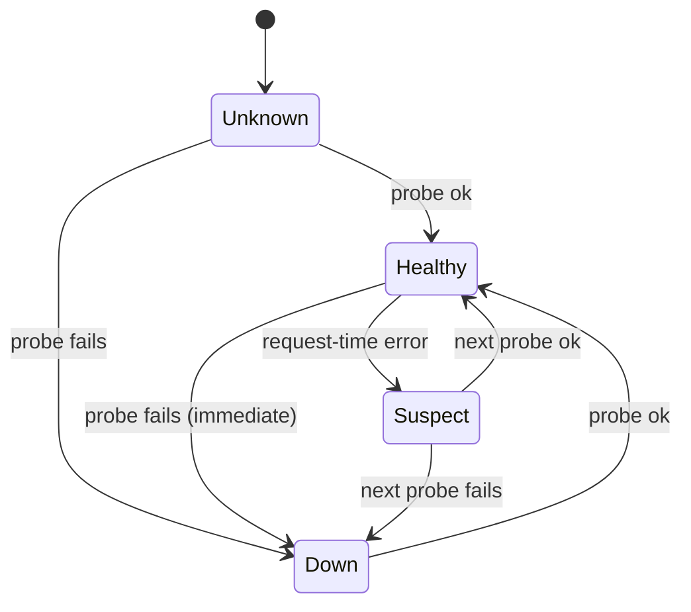

# ADR-0005: Backend discovery & health checking

- **Status:** Accepted
- **Date:** 2026-06-28
- **Deciders:** Matthew Bucci

## Context

Backends come and go. During development `gpu-1` was down while `gpu-0`
served — and vice versa. The router must know, at any moment, **which backends
are up and what models each serves**, without operator intervention, and must
not send traffic to a dead backend.

`GET /v1/models` is the one endpoint every OpenAI-compatible engine exposes and
is cheap to call. It doubles as a **liveness probe** and a **model catalog**.

## Decision

A single background **health loop** polls `GET /v1/models` on every configured
backend on an interval. Each poll updates two things atomically:

1. **Health** — success (HTTP 200, parseable body) within `timeout` ⇒ healthy.
2. **Discovery** — the set of model ids the backend advertises.

- A backend enters rotation only **after its first successful probe**.
- A request-time failure marks a backend **suspect**, which triggers a prompt
  re-probe ([ADR-0006](0006-routing-and-failover.md)); the loop confirms or
  clears it.
- State is published as an **immutable snapshot** swapped via `atomic.Value` (or
  delivered over a buffered channel) — readers get a consistent view with **no
  locks** ([ADR-0015](0015-code-style.md)).

The health loop owns the state; routing reads a snapshot. This keeps the read
path lock-free and the router stateless with respect to per-request data
([ADR-0006](0006-routing-and-failover.md)).

## Consequences

**Positive**
- Automatic failover and recovery; no manual backend toggling.
- Discovery and liveness share one cheap probe.
- Lock-free reads via snapshot swap.

**Negative / trade-offs**
- Up to one interval of staleness before a down backend is noticed (mitigated by
  the suspect fast-path on request errors).
- `/v1/models` says the server is up, not that a specific model will succeed —
  request-time errors still must be handled.

## Compliance

- **MUST** probe `GET /v1/models` per backend on a configurable interval/timeout.
- **MUST** keep a backend out of rotation until its first successful probe.
- **MUST** publish health/discovery as an immutable snapshot read without locks
  (no `sync.Mutex`); use `atomic.Value` or channel handoff.
- **MUST** run the health loop as a background goroutine owning the state.
- **SHOULD** fast-path re-probe a backend after a request-time failure.
