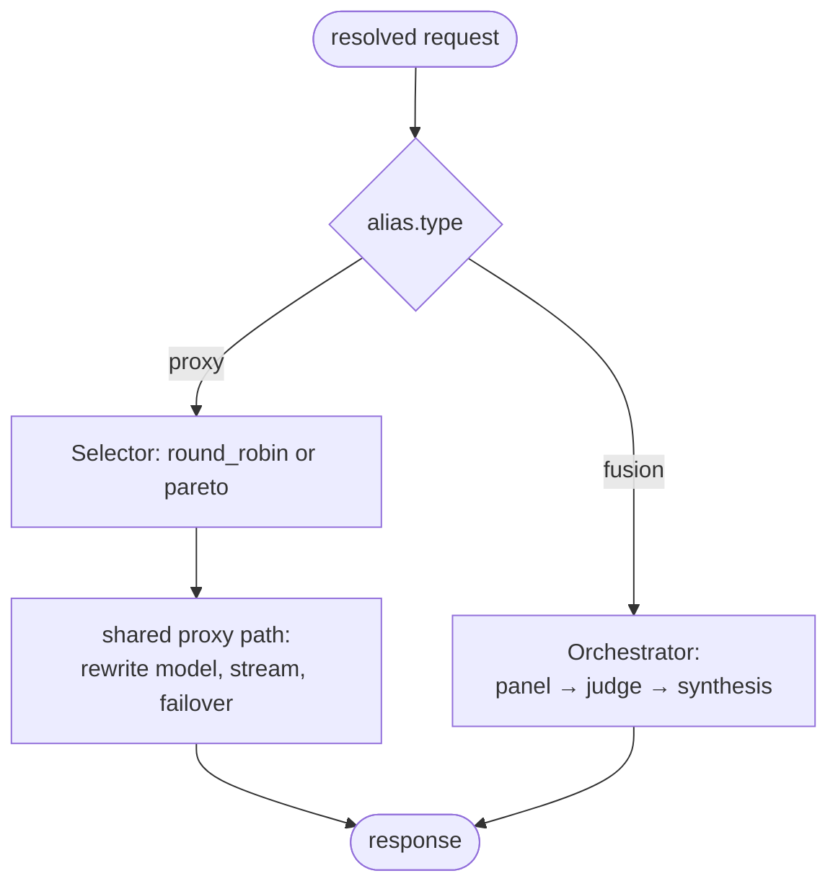

# ADR-0006: Routing framework — strategies, selection & failover

- **Status:** Accepted
- **Date:** 2026-06-28
- **Deciders:** Matthew Bucci

## Context

Different requests want different routing. Most want "send it to a healthy
backend that serves this model." Some want cost/quality optimization
([ADR-0013](0013-pareto-routing.md)) or multi-model deliberation
([ADR-0014](0014-fusion-routing.md)). We need one framework that supports simple
proxying *and* richer strategies without special-casing transport code.

## Decision

An alias declares a **routing strategy** via its `type`. The router dispatches on
that type. There are two shapes of strategy:

- **Selector strategies** (`type: proxy`) — the Selector **orders** healthy
  candidates best-first; the shared proxy path iterates that order with an attempt
  cap (`maxAttempts=3` = primary + two fallbacks), handling
  streaming/passthrough/failover. Pluggable selection policy: `round_robin`
  (default) or `pareto` ([ADR-0013](0013-pareto-routing.md)).
- **Orchestrator strategies** (`type: fusion`) — run a multi-backend workflow and
  synthesize a result ([ADR-0014](0014-fusion-routing.md)).



Interfaces (owned by `internal/router`, per [ADR-0003](0003-layered-architecture.md)):

```go
// Selector orders ALL healthy candidates best-first (health-filtered against the
// snapshot); the proxy iterates that order. There is no Pick and no `tried` map.
type Selector interface {
    Order(snap *model.Snapshot, req *model.ChatRequest, candidates []Candidate, minQuality float64) []Candidate
}

// Strategy turns a resolved request into a response written to the sink and
// returns an *Outcome for the per-request log line (ADR-0011). proxy strategies
// wrap a Selector; fusion implements its own.
type Strategy interface {
    Execute(ctx context.Context, req *model.ChatRequest, plan *Plan, sink ResponseSink) (*Outcome, error)
}
```

### Selection (proxy strategies)

Default is **round-robin** across healthy candidates. To honor statelessness and
the no-locks rule ([ADR-0015](0015-code-style.md)), round-robin uses a lock-free
counter (`sync/atomic`) or request-derived rotation — never a mutex-guarded map.
`pareto` selection is defined in [ADR-0013](0013-pareto-routing.md).

### Health filtering

Only backends marked healthy in the current snapshot
([ADR-0005](0005-backend-discovery-and-health.md)) are candidates.

| Situation | Result |
|-----------|--------|
| Name resolves to no backend | `404 model_not_found` |
| Candidates exist, none healthy | `503 no_healthy_backend` |
| All attempts exhausted | `502 upstream_unavailable` |

### Failover (proxy strategies)

| Failure | Retry another candidate? |
|---------|--------------------------|
| Connect refused/reset/timeout | yes |
| Upstream `502/503/504` | yes |
| Upstream `4xx` | no — request is wrong |
| Stream already emitting bytes | no — cannot restart cleanly |
| `ctx` canceled / client gone | no — stop work |

Retries are bounded by healthy-candidate count and an attempt cap. A failed
backend is marked **suspect** to trigger a fast re-probe. Once a streamed
response has emitted bytes, failover is impossible
([ADR-0007](0007-streaming.md)).

### Statelessness

The router keeps no per-request state; rationale and the no-locks rule are owned
by [ADR-0015](0015-code-style.md).

## Consequences

**Positive**
- One framework spans plain proxying and advanced strategies.
- Selection policy is swappable without touching transport.

**Negative / trade-offs**
- The `Strategy`/`Selector` split adds indirection.
- Orchestrator strategies (fusion) break pure passthrough by design — called out
  explicitly in their ADR.

## Compliance

- **MUST** select the strategy from the resolved alias's `type`; default `proxy`
  with `round_robin`.
- **MUST** consider only healthy backends as candidates.
- **MUST** map outcomes to `404` / `503` / `502` as tabled above.
- **MUST** implement round-robin without a mutex (atomic or request-derived).
- **MUST NOT** retry on `4xx`, after stream bytes are sent, or on context cancel.
- **MUST NOT** store per-request state beyond the request lifetime.
- **MUST** define `Selector`/`Strategy` as interfaces in `internal/router`.
