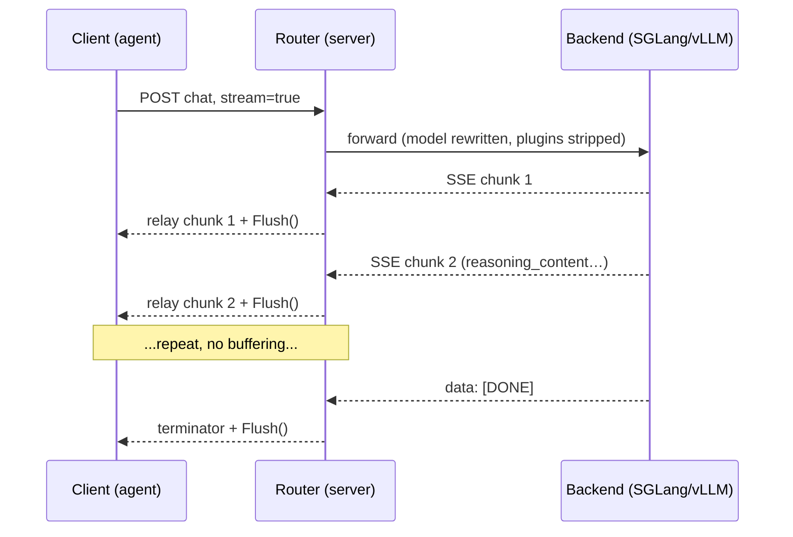

# ADR-0007: Streaming via SSE passthrough

- **Status:** Accepted
- **Date:** 2026-06-28
- **Deciders:** Matthew Bucci

## Context

Agents expect token-by-token streaming. Both fleet backends stream over
**Server-Sent Events** when a request sets `stream: true`. Latency to first token
matters, so the router must not buffer a whole response before relaying it.

The two consumer protocols frame streams differently
([ADR-0016](0016-multi-protocol.md)): OpenAI emits `data: {json}\n\n` chunks
terminated by `data: [DONE]`; Anthropic emits a typed event stream
(`event: <type>\n` + `data: {json}\n\n`). The router must relay or translate
these incrementally while preserving non-standard fields like `reasoning_content`
([ADR-0001](0001-transparent-openai-passthrough.md)).

## Decision

When the request body has `stream: true`, the router takes the **streaming
response path**: it opens the upstream stream and relays each chunk to the client
**as it arrives**, flushing immediately, never buffering the full response.

### Implementation

- The request goroutine reads upstream and writes the client **synchronously** —
  a record-boundary splice (canonical path) or a verbatim byte copy (native
  same-protocol path, [ADR-0016](0016-multi-protocol.md)) — never a goroutine
  pipeline or a mutex-guarded buffer ([ADR-0015](0015-code-style.md)).
- After every chunk, call `http.Flusher.Flush()` so bytes leave immediately.
- **Same-protocol** (OpenAI→OpenAI, Anthropic→Anthropic): relay raw bytes, splice
  on SSE record boundaries (`\n\n`); unknown fields survive untouched.
- **Cross-protocol**: the edge adapters translate each event incrementally —
  OpenAI deltas ⇄ Anthropic `message_start`/`content_block_delta`/`message_stop`
  — emitting in the consumer's framing ([ADR-0016](0016-multi-protocol.md)).
- Set `Content-Type: text/event-stream`, `Cache-Control: no-cache`, and disable
  proxy buffering on the response.

### No failover once streaming starts

The streaming path picks **one** backend; pre-first-byte connect failures may
still fail over, but once any byte reaches the client the response is committed
and is **never** retried elsewhere ([ADR-0006](0006-routing-and-failover.md)).

### Cancellation and timeouts

- The client's request `context.Context` is propagated to the upstream call. If
  the client disconnects, the context is canceled and the **upstream request is
  aborted** — no orphaned generation.
- Connect and idle timeouts apply; streams are **exempt from an overall request
  deadline** (a long generation is not an error).

### Fusion

Fusion ([ADR-0014](0014-fusion-routing.md)) runs its panel and judge internally
and streams **only the final synthesis** to the client via this same path; the
panel/judge phases are not streamed.

## Consequences

**Positive**
- Low time-to-first-token; constant memory regardless of response length.
- Reasoning/streaming fields preserved on the same-protocol path.

**Negative / trade-offs**
- No failover after first byte — a mid-stream backend failure reaches the client.
- Incremental cross-protocol translation is stateful within a single stream and
  must be tested carefully ([ADR-0012](0012-testing.md)).

## Compliance

- **MUST** take the streaming path when the request sets `stream: true`.
- **MUST NOT** buffer the full response; relay and `Flush()` each chunk as it
  arrives.
- **MUST** propagate client cancellation to abort the upstream request.
- **MUST NOT** fail over once any response byte has been written to the client.
- **MUST** exempt streaming responses from an overall request deadline while
  honoring connect/idle timeouts.
- **MUST NOT** guard the relay path with a `sync.Mutex`; the synchronous
  streaming copy in the request goroutine needs no shared-state lock.
- **SHOULD** set `Content-Type: text/event-stream` and disable downstream
  buffering.
- **SHOULD** test incremental cross-protocol stream translation in both
  directions.
