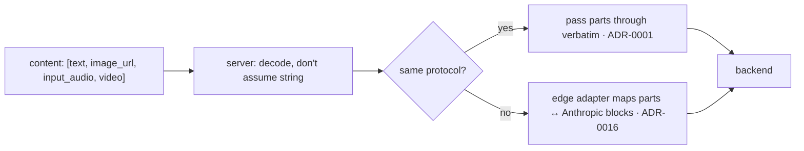

# ADR-0008: Multimodal content & large request bodies

- **Status:** Accepted
- **Date:** 2026-06-28
- **Deciders:** Matthew Bucci

## Context

Agents send more than text. Verified live on the fleet: `gemma4-31b` on
`gpu-1` accepts OpenAI multimodal content arrays — a request with a base64
`image_url` data URL returned a correct answer and reported
`usage.prompt_tokens_details.image_tokens: 256`. So vision already works as plain
**content-part passthrough**; audio and video use the same mechanism.

Two consequences fall out of this:

1. The `content` field of a message may be a **string** *or* an **array of typed
   parts** (`text`, `image_url`, `input_audio`, `video`, …). Code that assumes
   `content` is a string will corrupt multimodal requests.
2. Base64-encoded media makes request bodies **large** — megabytes for an image,
   far more for audio/video. A small body-size cap would reject legitimate
   requests.

## Decision

Treat multimodal as **transparent content passthrough** plus **large-body
tolerance**.

- **Never assume `content` is a string.** The canonical model
  ([ADR-0003](0003-layered-architecture.md)) represents `content` as either a
  string or an ordered list of parts; unrecognized part types pass through
  untouched ([ADR-0001](0001-transparent-openai-passthrough.md)).
- **Cross-protocol** content translation (OpenAI parts ↔ Anthropic content
  blocks, e.g. `image_url` ↔ `image` source blocks) is done by the edge adapters,
  not by routing ([ADR-0016](0016-multi-protocol.md)).
- **Large bodies:** no small `MaxBytesReader` cap. The max request size is
  configurable with a generous default (≥ 100 MB,
  [ADR-0010](0010-configuration.md)). The body is **buffered whole** (`io.ReadAll`
  bounded by `max_body_size`), not streamed, so the bytes are replayable on
  failover ([ADR-0006](0006-routing-and-failover.md)) and translatable across
  protocols ([ADR-0016](0016-multi-protocol.md)). Memory is therefore *not* flat
  under large uploads; streaming the body to the upstream is a future optimization
  available only on the non-replay, same-protocol path.
- **Capabilities are optional metadata.** An alias/backend MAY note supported
  modalities (gemma = vision, north = text/code) for diagnostics, but the router
  does not gate on it — the backend is the authority and rejects what it can't do.

## Consequences

**Positive**
- Image/audio/video work today with no special handling, across protocols.
- Large uploads are accepted (bounded by `max_body_size`) rather than rejected by
  a small cap.

**Negative / trade-offs**
- Buffering the whole body (required for replay and cross-protocol translation)
  means memory is not flat under large uploads; `max_body_size` bounds the worst
  case.
- A generous body cap raises abuse surface if the router is ever exposed
  (mitigated by auth, [ADR-0009](0009-authentication.md)).
- Only image was live-verified; audio/video rely on the same passthrough path and
  the backend's own support.

## Compliance

- **MUST NOT** assume `content` is a string anywhere; handle the array-of-parts
  form.
- **MUST** pass unrecognized content-part types through unchanged on the
  same-protocol path.
- **MUST** translate content parts in edge adapters on the cross-protocol path,
  never in `internal/router`.
- **MUST NOT** impose a small request-body cap; the limit is configurable with a
  large default.
- **MAY** record per-alias/backend modality metadata, but **MUST NOT** reject a
  request solely on it.
