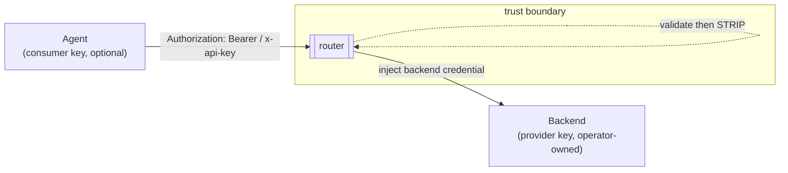

# ADR-0009: Authentication & the trust boundary

- **Status:** Accepted
- **Date:** 2026-06-28
- **Deciders:** Matthew Bucci

## Context

There are **two independent** credential concerns, and conflating them is a
common security bug:

1. **Consumer-side (inbound).** Agents call the router. On a trusted LAN no key
   is needed, but the router may be exposed more widely, so it must be *able* to
   require a key — and accept whichever header style matches the consumer
   protocol ([ADR-0016](0016-multi-protocol.md)): OpenAI sends
   `Authorization: Bearer <key>`, Anthropic sends `x-api-key: <key>`.
2. **Provider-side (outbound).** Backends may require their own credentials
   (an API key, and for Anthropic an `anthropic-version`). These belong to the
   router/operator, **not** to agents — an agent must never need or hold a
   backend credential.

The trust boundary: agents are semi-trusted; backends are operator-owned. The
router sits between them and owns the backend credentials.

## Decision

**Inbound auth is optional and pluggable.** Configuration holds a list of
accepted static tokens ([ADR-0010](0010-configuration.md)). Behavior:

- If the list is **non-empty**, every request MUST present a matching token
  (`Authorization: Bearer <key>` or `x-api-key: <key>`); otherwise the router
  rejects with **401**.
- If the list is **empty/unset**, the router trusts the LAN and accepts all
  requests.
- Token comparison is **constant-time** to avoid timing oracles.
- The check is a single middleware behind an `Authenticator` interface so a real
  IdP (JWT/OAuth) can replace static tokens later without touching handlers.

**Outbound auth is per-backend and injected by the router.** Each backend's
config carries its optional credential. Before proxying, the outbound adapter
([ADR-0016](0016-multi-protocol.md)) injects the credential in the form the
**provider protocol** expects:

| Provider protocol | Injected header(s) |
|-------------------|--------------------|
| `openai` | `Authorization: Bearer <backend key>` |
| `anthropic` | `x-api-key: <backend key>`, `anthropic-version: <configured>` |

**The inbound credential is stripped at the boundary.** The router removes the
consumer's `Authorization`/`x-api-key` after validating it and never forwards it
upstream — the backend only ever sees the router's injected credential. This is
the header-level analogue of the body-level stripping in
[ADR-0001](0001-transparent-openai-passthrough.md).

All secrets come from config/env ([ADR-0010](0010-configuration.md)) and are
**redacted** from logs and errors ([ADR-0011](0011-observability.md)).

## Consequences

**Positive**
- LAN stays zero-friction; exposure is a config toggle, not a rewrite.
- Agents never hold backend credentials; rotation is an operator-only concern.
- Clean separation lets the inbound scheme evolve to a real IdP independently.

**Negative / trade-offs**
- Static tokens are coarse (no per-agent identity/quota) — acceptable for v1, and
  the interface leaves room to grow.
- The router is now a secret-holder and must handle redaction carefully.

## Compliance

- **MUST** validate the inbound token when accepted tokens are configured, and
  reject missing/invalid with **401**.
- **MUST** accept both `Authorization: Bearer` and `x-api-key` inbound styles.
- **MUST** use a constant-time comparison for inbound token checks.
- **MUST** strip the inbound consumer credential and **MUST NOT** forward it to
  any backend.
- **MUST** inject the backend's own credential per provider protocol
  (`Authorization: Bearer` for openai; `x-api-key` + `anthropic-version` for
  anthropic).
- **MUST NOT** log or include secrets in errors; redact them.
- **MUST** load all credentials from config/env, never hard-coded.
- **MUST** place inbound auth behind an `Authenticator` interface.
