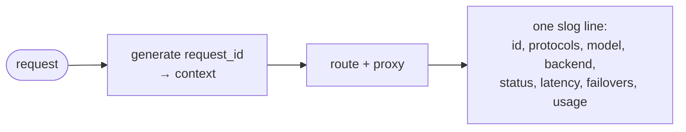

# ADR-0011: Observability — logging & metrics

- **Status:** Accepted
- **Date:** 2026-06-28
- **Deciders:** Matthew Bucci

## Context

A router is on the critical path for every agent call. When something is slow or
failing, operators need to answer "which backend, which model, what status, how
long, how many retries?" without attaching a debugger. That requires structured
logs, request-scoped correlation, and scrape-able metrics.

The fleet is heterogeneous and backends flap ([ADR-0005](0005-backend-discovery-and-health.md)),
so per-backend and per-model breakdowns matter. At the same time the code-style
rule is **stdlib-first** ([ADR-0015](0015-code-style.md)): observability must not
drag in a logging or metrics framework without an explicit decision.

## Decision

### Structured logging

Use the standard library **`log/slog`** — no third-party logger. Emit **one
structured log line per request**, written after the response completes, with at
least these fields:

| Field | Source |
|-------|--------|
| `request_id` | generated per request, propagated via `context.Context` |
| `consumer_protocol` | inbound shape, openai/anthropic ([ADR-0016](0016-multi-protocol.md)) |
| `model_alias` | the `model` the consumer sent ([ADR-0004](0004-model-aliasing.md)) |
| `upstream_model` | resolved upstream id |
| `backend` | chosen backend name |
| `provider_protocol` | backend shape, openai/anthropic |
| `status` | final HTTP status returned to the consumer |
| `latency_ms` | wall-clock for the request |
| `failovers` | retry/failover count ([ADR-0006](0006-routing-and-failover.md)) |
| `prompt_tokens`, `completion_tokens`, `reasoning_tokens` | from response `usage` |

A `request_id` is generated at ingress and carried on `context.Context` across
every layer ([ADR-0003](0003-layered-architecture.md)), so all log lines for a
request correlate.

Privacy and size: **never log prompts, completions, secrets, or auth headers.**
Body sizes (byte counts) and token usage may be logged.

### Metrics

Expose **Prometheus text format** at `GET /metrics` **without a third-party
client** — hand-rolled counters/histograms (optionally `expvar`-backed) over
`net/http`, to honor the stdlib-first rule. Minimum series:

- request count by `backend`, `model`, `status`
- request latency histogram
- in-flight requests gauge
- backend health gauge (per backend, per [ADR-0005](0005-backend-discovery-and-health.md))
- failover counter

If a metrics dependency is ever genuinely warranted, it requires its own decision
and an addition to the [ADR-0015](0015-code-style.md) dependency allowlist.

### Health & readiness

- `GET /healthz` — the router process is up (always 200 while serving).
- `GET /readyz` — 200 only when **≥1 backend is healthy**, else 503, reading the
  health snapshot ([ADR-0005](0005-backend-discovery-and-health.md)).

## Consequences

**Positive**
- Per-request correlation and per-backend/model breakdowns with zero extra deps.
- `/readyz` integrates cleanly with orchestrators and load balancers.

**Negative / trade-offs**
- Hand-rolled metrics are more code than importing a client and cover less.
- One-line-per-request logging omits deep traces; distributed tracing, if needed,
  is a future ADR.

## Compliance

- **MUST** use `log/slog`; **MUST NOT** import a third-party logging library.
- **MUST** generate a `request_id` per request and propagate it via
  `context.Context`.
- **MUST** emit one structured log line per request with the fields tabled above.
- **MUST NOT** log prompt/response bodies, secrets, or auth headers.
- **MUST** serve Prometheus text at `GET /metrics` with no third-party metrics
  client.
- **MUST** expose `GET /healthz` and `GET /readyz`, with `/readyz` gated on ≥1
  healthy backend.
- **SHOULD** label request metrics by backend, model, and status.
