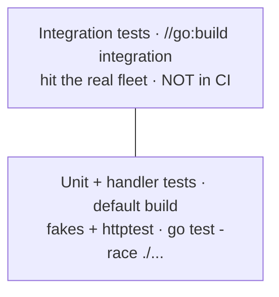

# ADR-0012: Testing strategy

- **Status:** Accepted
- **Date:** 2026-06-28
- **Deciders:** Matthew Bucci

## Context

The router's correctness lives in subtle invariants: unknown fields must survive
([ADR-0001](0001-transparent-openai-passthrough.md)), status mapping must be
exact ([ADR-0006](0006-routing-and-failover.md)), cross-protocol translation must
round-trip ([ADR-0016](0016-multi-protocol.md)), and shared state is lock-free
([ADR-0005](0005-backend-discovery-and-health.md),
[ADR-0015](0015-code-style.md)). None of this needs a GPU to verify — but all of
it needs to be verified automatically, every commit.

The fleet ([gpu-0 `north`, gpu-1 `gemma4-31b`]) is real but intermittently
available, so it cannot be a dependency of normal CI.

## Decision

Test in two tiers, with the bulk of coverage requiring no live backend.

- **Standard library only.** Tests use `testing` with **table-driven** cases and
  `net/http/httptest` for fake upstreams. No assertion or mock frameworks
  ([ADR-0015](0015-code-style.md)).
- **Fakes, not GPUs.** Unit tests inject fakes implementing the router's
  `Backend` and `Selector` interfaces ([ADR-0003](0003-layered-architecture.md));
  end-to-end handler tests run the real server against `httptest.Server`
  upstreams that mimic OpenAI/Anthropic responses. This is the default build and
  the only tier CI runs.
- **Always `-race`.** CI runs `go test -race ./...`. The health/discovery
  snapshot is published lock-free via `atomic.Value`
  ([ADR-0005](0005-backend-discovery-and-health.md)); the race detector is what
  guards that invariant — it is not optional.
- **Integration tier is opt-in.** Tests behind `//go:build integration` exercise
  the live fleet (`gpu-0:8000` → `north`, `gpu-1:8000` →
  `gemma4-31b`). Run manually (`go test -tags integration ./...`); never in
  normal CI.

### Invariants that must have tests

| Invariant | Source |
|-----------|--------|
| Unknown response field (`reasoning_content`) survives the router | [ADR-0001](0001-transparent-openai-passthrough.md) |
| `model` rewritten to upstream id; `plugins` stripped, never forwarded | [ADR-0001](0001-transparent-openai-passthrough.md) |
| Alias vs direct resolution; `404` vs `503` vs `502` mapping | [ADR-0004](0004-model-aliasing.md), [ADR-0006](0006-routing-and-failover.md) |
| Failover rules, incl. **no retry after stream bytes sent** | [ADR-0006](0006-routing-and-failover.md), [ADR-0007](0007-streaming.md) |
| Cross-protocol round-trip for all four matrix cells | [ADR-0016](0016-multi-protocol.md) |
| Multimodal `content` handled as an array, never assumed a string | [ADR-0008](0008-multimodal-and-large-bodies.md) |
| No secrets/keys in logs | [ADR-0009](0009-authentication.md), [ADR-0011](0011-observability.md) |

## Consequences

**Positive**
- CI is fast, hermetic, and GPU-free; the hard invariants are pinned by tests.
- `-race` continuously validates the lock-free design.

**Negative / trade-offs**
- Fakes can drift from real engine behavior; the integration tier is the periodic
  reality check.
- Maintaining four-way translation tests is real effort — accepted as the cost of
  [ADR-0016](0016-multi-protocol.md).

## Compliance

- **MUST** keep the default `go test ./...` green without any live backend.
- **MUST** run `go test -race ./...` in CI.
- **MUST** use only the standard library (`testing`, `net/http/httptest`); no
  third-party test frameworks.
- **MUST** use table-driven tests for case-based logic (resolution, status
  mapping, translation).
- **MUST** gate any test that contacts the real fleet behind `//go:build
  integration`.
- **MUST** cover every invariant in the table above.
- **SHOULD** inject fakes via the `Backend`/`Selector` interfaces rather than
  hitting real HTTP where a unit test suffices.
