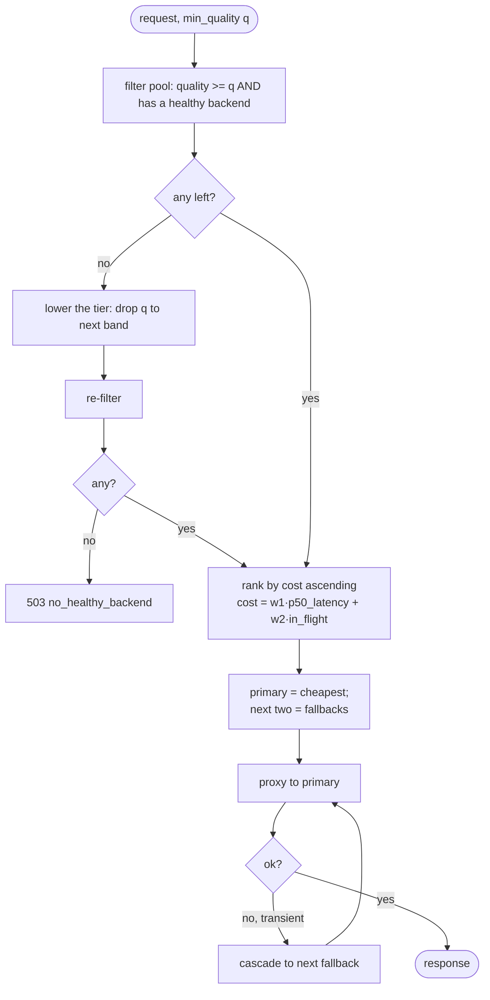

# ADR-0013: Pareto routing strategy

- **Status:** Accepted
- **Date:** 2026-06-28
- **Deciders:** Matthew Bucci

## Context

[OpenRouter's Pareto router](https://openrouter.ai/docs/guides/routing/routers/pareto-router)
picks the **cheapest model that is still good enough** for a task — maximizing
value without overspending — using a catalog ranked by Artificial Analysis
coding percentiles, with `min_coding_score` mapped to quality tiers and price as
the in-tier tiebreaker, cascading to fallbacks on failure.

We want that behavior on a **local fleet**, but the inputs differ: there is no
marketplace price-per-token and no external percentile feed. What we *do* have is
a small set of models with operator knowledge of their relative strength, plus
live signals (latency, in-flight load). "Cost" locally means **GPU time** —
latency and contention — not dollars.

## Decision

Add a `pareto` **Selector** ([ADR-0006](0006-routing-and-failover.md)) that, for
an alias pointing at a *pool* of candidate models, picks the cheapest-good-enough
one on a quality/cost frontier.

```yaml
aliases:
  smart:
    type: proxy
    selector: pareto
    min_quality: 0.6          # default constraint; overridable per request
    pool:
      - { model: /models/North-Mini-Code-1.0-fp8, backends: [gpu-0], quality: 0.9 }
      - { model: gemma4-31b, backends: [gpu-1], quality: 0.6 }
```

Per request, an agent may tighten the bar via the reserved `plugins` field
([ADR-0001](0001-transparent-openai-passthrough.md)), mirroring OpenRouter:

```json
{ "model": "smart",
  "plugins": [{ "id": "pareto", "min_quality": 0.8 }] }
```

### Algorithm



1. **Tier filter.** Keep pool entries whose `quality >= min_quality` *and* that
   have at least one healthy backend ([ADR-0005](0005-backend-discovery-and-health.md)).
2. **Cost rank.** Order survivors by a local cost score — a weighted function of
   measured p50 latency and current in-flight count (both come from the health/
   metrics signals, [ADR-0011](0011-observability.md)). Cheapest is primary; the
   next two are fallbacks.
3. **Cascade.** On a transient failure, advance through same-tier fallbacks
   before relaxing the tier — reusing the failover rules of
   [ADR-0006](0006-routing-and-failover.md).

The selected concrete `(model, backend)` is reported back via the `X-Router-Model`
and `X-Router-Backend` response headers ([ADR-0020](0020-response-provenance-headers.md)); the
router does not rewrite the response `model` field and adds no body marker — bodies
are relayed verbatim ([ADR-0001](0001-transparent-openai-passthrough.md)).

Latency/load signals are read from the lock-free snapshot
([ADR-0005](0005-backend-discovery-and-health.md), [ADR-0015](0015-code-style.md));
the selector itself is **stateless and lock-free**.

## Consequences

**Positive**
- Cheap requests stay on cheap models; only quality-demanding ones escalate.
- Reuses the existing Selector + failover machinery — it's "just another Selector."

**Negative / trade-offs**
- `quality` scores are operator-assigned, not benchmarked — garbage in, garbage
  out. A future ADR could seed them from a local eval harness.
- Cost weights need tuning per fleet.

## Compliance

- **MUST** implement Pareto as a `Selector` behind the
  [ADR-0006](0006-routing-and-failover.md) interface — no special transport path.
- **MUST** filter by `min_quality` AND backend health before ranking.
- **MUST** read latency/load only from the lock-free snapshot; the selector
  **MUST NOT** hold locks or per-request state.
- **MUST** honor a per-request `min_quality` from the `plugins` field and strip
  that field before forwarding ([ADR-0001](0001-transparent-openai-passthrough.md)).
- **MUST** report the concrete model selected back to the caller.
- **SHOULD** cascade through fallbacks before relaxing the tier.
