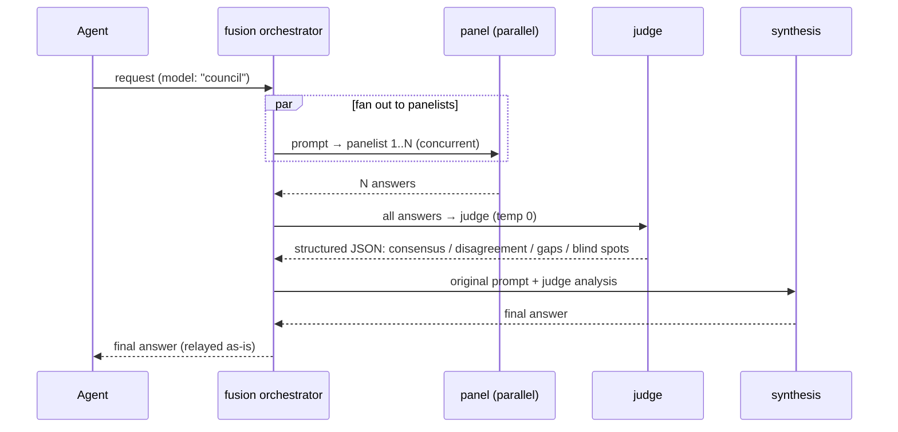

# ADR-0014: Fusion routing strategy

- **Status:** Accepted
- **Date:** 2026-06-28
- **Deciders:** Matthew Bucci

## Context

[OpenRouter's Fusion router](https://openrouter.ai/docs/guides/routing/routers/fusion-router)
improves answer quality by **deliberation**: a panel of up to 8 models answers in
parallel, a judge model produces a *structured comparison* (consensus,
disagreements, coverage gaps, blind spots — it does **not** merge text), and the
outer model synthesizes a final answer. It costs ~4–5× a single completion with
the default 3-model panel.

We want this for high-stakes local queries. On our fleet "cost" is GPU time, not
dollars, so the multiplier is more acceptable — but fusion is fundamentally
**not** a transparent proxy: it orchestrates several calls and produces a
synthesized result.

## Decision

Add a `fusion` **Orchestrator strategy** ([ADR-0006](0006-routing-and-failover.md)).
Unlike proxy strategies it does not pick one backend; it runs a fixed workflow.

```yaml
aliases:
  council:
    type: fusion
    panel:                     # 1..8 panelists
      - { model: /models/North-Mini-Code-1.0-fp8, backends: [gpu-0] }
      - { model: gemma4-31b, backends: [gpu-1] }
    judge:    { model: /models/North-Mini-Code-1.0-fp8, backends: [gpu-0] }
    synthesis:{ model: /models/North-Mini-Code-1.0-fp8, backends: [gpu-0] }
    temperature: 0.7           # panel; judge always runs at 0
    max_completion_tokens: 2048
```

### Workflow



1. **Panel (parallel).** Fan the prompt out to every panelist concurrently. Use a
   **buffered channel** to collect results and `context` for cancellation — no
   locks ([ADR-0015](0015-code-style.md)). Panelists that fail or time out are
   dropped; proceed if at least one (configurable minimum) responds.
2. **Judge (temp 0).** Send all panel answers to the judge, which returns
   *structured analysis as JSON* — it compares, it does not merge.
3. **Synthesis.** The synthesis model receives the original prompt plus the
   judge's analysis and writes the final answer returned to the caller.

`resolveFusion` pins exactly one healthy backend per role (each panelist, the
judge, the synthesis model); every internal call then goes straight to that
backend's standard backend/health path
([ADR-0005](0005-backend-discovery-and-health.md),
[ADR-0006](0006-routing-and-failover.md)) and protocol adapters
([ADR-0016](0016-multi-protocol.md)), so panelists may even be different
protocols. There is **no per-call failover cascade**: a panelist failure drops
that answer (tolerated down to `min_panel_responses`), judge failure is non-fatal
(synthesis proceeds without analysis), and synthesis failure is fatal (502).
Web-search/fetch tools from OpenRouter's design are **out of scope** (not
available locally).

### Streaming & passthrough

Fusion is exempt from transparent passthrough by design
([ADR-0001](0001-transparent-openai-passthrough.md)) — it synthesizes. Only the
**final synthesis** is streamed to the client ([ADR-0007](0007-streaming.md));
panel and judge calls are internal. The synthesis response body is relayed
**as-is** (no `metadata.router` body marker), but fusion **does** stamp the
`X-Router-Model` / `X-Router-Backend` provenance headers with the synthesis model
and backend ([ADR-0020](0020-response-provenance-headers.md)), so a caller can see
which model produced the final answer.

It remains **stateless** across requests ([ADR-0006](0006-routing-and-failover.md)).

## Consequences

**Positive**
- Higher-quality answers on hard prompts via deliberation, on local GPUs.
- Reuses backend/health/adapters; only the orchestration is new.

**Negative / trade-offs**
- ~Nx latency and GPU cost (N = panel size + judge + synthesis). Opt-in per alias.
- Not passthrough; provider-specific fields are not preserved through synthesis.

## Compliance

- **MUST** implement fusion as a `Strategy` orchestrator, selected by alias
  `type: fusion`.
- **MUST** fan out to panelists concurrently using buffered channels + context,
  **no locks** ([ADR-0015](0015-code-style.md)).
- **MUST** run the judge at temperature 0 and treat its output as structured
  analysis (not a merge).
- **MUST** stream only the final synthesis; panel/judge calls stay internal.
- **MUST** route every internal call through the standard backend/health/adapter
  path.
- **MUST** tolerate panelist failures down to a configurable minimum.
- **MUST NOT** retain state across requests.
