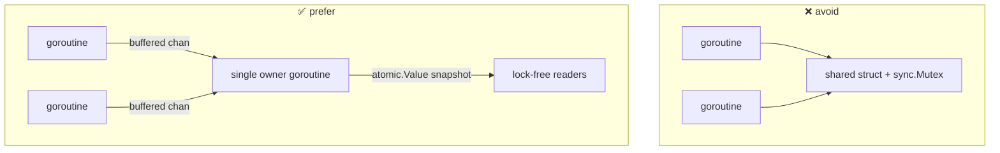

# ADR-0015: Code style & concurrency conventions

- **Status:** Accepted
- **Date:** 2026-06-28
- **Deciders:** Matthew Bucci

## Context

A router is a concurrency-heavy proxy: many in-flight requests, a background
health loop, streaming relays, and fan-out strategies ([ADR-0014](0014-fusion-routing.md)).
The concurrency model we choose shapes every package. We want code that is
simple, lock-free, and easy to reason about, leaning on Go's strengths.

## Decision

Adopt a **CSP / share-by-communicating** style with a strong standard-library
bias.

### Concurrency

- **No locks.** Do **not** use `sync.Mutex` / `sync.RWMutex` to guard shared
  mutable state. Coordinate with **channels** instead, or publish immutable
  snapshots via `atomic.Value` (the health snapshot,
  [ADR-0005](0005-backend-discovery-and-health.md)). Lock-free primitives in
  `sync/atomic` and one-shot helpers (`sync.Once`, `sync.WaitGroup`,
  `errgroup`) are allowed — they are not locks around state.
- **Prefer buffered channels.** Use buffered channels sized to expected
  concurrency to decouple producers from consumers and avoid goroutine stalls;
  reserve unbuffered channels for strict handoff/signaling.
- **Async over sync.** Prefer non-blocking, goroutine-driven designs (fan-out,
  pipelines, background loops) over blocking call chains. Every goroutine has a
  clear owner and a termination path tied to a `context.Context`; no goroutine
  leaks.
- **State ownership.** Mutable state is owned by exactly one goroutine that others
  reach via channels — not by a shared struct with a lock.

### Statelessness

- The request path holds **no shared mutable state** between requests
  ([ADR-0006](0006-routing-and-failover.md)). Long-lived state (health,
  discovery) is a single-owner background concern exposed as immutable snapshots.

### Dependencies

- **Standard library first.** Use the Go stdlib (`net/http`, `encoding/json`,
  `context`, `log/slog`, …) unless a dependency is **absolutely necessary**. A new
  third-party dependency requires explicit justification in the PR and, ideally,
  its own ADR. YAML config parsing is the kind of narrow, justified exception
  ([ADR-0010](0010-configuration.md)).

### General

- Errors are wrapped with `%w` and context; the request path **never panics**.
- `context.Context` is the first parameter of request-path functions and is
  propagated to every upstream call and goroutine.
- Exported symbols are documented; code matches `gofmt`/`go vet`.

## Consequences

**Positive**
- Lock-free, channel-oriented code is easier to reason about and race-free by
  construction.
- A thin dependency tree is easy to audit and keeps the binary small.

**Negative / trade-offs**
- Channel-based coordination can be more verbose than a quick mutex.
- "Stdlib unless absolutely necessary" occasionally means writing a small helper
  instead of pulling a library.

## Compliance

- **MUST NOT** use `sync.Mutex` or `sync.RWMutex` anywhere.
- **MUST** coordinate shared state via channels or `atomic.Value` snapshots.
- **SHOULD** prefer buffered channels; unbuffered only for deliberate handoff.
- **MUST** tie every goroutine's lifetime to a `context.Context`; no leaks.
- **MUST** keep the request path panic-free and propagate `context.Context`.
- **MUST NOT** add a third-party dependency without explicit justification
  (an ADR or PR note).
- **MUST** pass `gofmt` and `go vet`.
