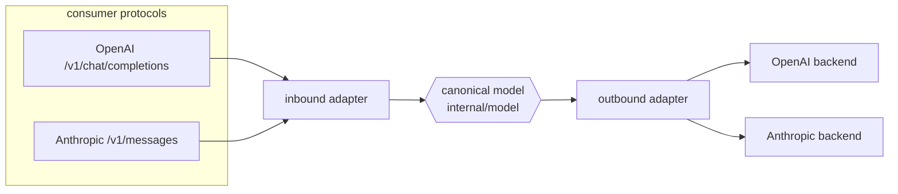

# ADR-0016: Multi-protocol consumers & providers (OpenAI + Anthropic)

- **Status:** Accepted
- **Date:** 2026-06-28
- **Deciders:** Matthew Bucci

## Context

Agents are written against different SDKs. Some speak the **OpenAI** API
(`POST /v1/chat/completions`), others the **Anthropic** API (`POST /v1/messages`).
The same split exists on the provider side: a backend may expose an
OpenAI-compatible surface (vLLM, SGLang — see
[ADR-0002](0002-engine-agnostic-backends.md)) or an Anthropic-compatible one.

The router must let **any supported consumer protocol reach any supported provider
protocol**. A request shaped like Anthropic must be answerable by an
OpenAI-speaking backend, and vice versa.

The two shapes differ structurally: system prompt placement (`system` field vs a
`system` role message), content-block schemas, streaming event framing (OpenAI
SSE `data:` chunks vs Anthropic typed `event:`/`data:` stream), and
stop/usage fields.

## Decision

Introduce a **canonical internal model** and **protocol adapters** on both edges.

- **Consumer protocol** is determined by the **endpoint** hit
  (`/v1/chat/completions` = OpenAI, `/v1/messages` = Anthropic). The inbound
  adapter (`internal/server`) decodes into the canonical model.
- **Provider protocol** is declared per backend in config (`protocol: openai |
  anthropic`, default `openai`). The outbound adapter (`internal/backend`)
  encodes the canonical model into that shape and decodes the reply back.
- The **canonical model** lives in `internal/model` and is the single
  representation routing operates on ([ADR-0003](0003-layered-architecture.md)); it
  is OpenAI-shaped — the pivot every translation passes through
  ([ADR-0017](0017-canonical-openai-pivot.md)).

### Fidelity rule: prefer same-protocol

Translation is lossy for provider-specific extras (e.g. `reasoning_content`,
`cache_control`). So for **round_robin** and **direct-id** resolution, when the
resolved candidates include a backend whose protocol **matches the consumer's**,
the router **prefers it** — reordering the failover sequence to try that backend
first (it only reorders; it never translates). Anthropic→Anthropic then takes a
verbatim native relay ([ADR-0018](0018-native-same-protocol-relay.md)); OpenAI→OpenAI takes the
ordinary passthrough ([ADR-0001](0001-transparent-openai-passthrough.md)).
Cross-protocol translation happens only when no same-protocol backend is available.

The **pareto** selector is the deliberate exception: its cost ordering
([ADR-0013](0013-pareto-routing.md)) is authoritative and is **not** re-partitioned
by protocol, so a pareto alias may try a cheaper cross-protocol backend ahead of an
available same-protocol one — re-sorting by protocol would promote a costlier
same-protocol candidate over the cheapest.

### Translation matrix

| Consumer → Provider | Path | Fidelity |
|---------------------|------|----------|
| OpenAI → OpenAI | passthrough | full ([ADR-0001](0001-transparent-openai-passthrough.md)) |
| Anthropic → Anthropic | native relay ([ADR-0018](0018-native-same-protocol-relay.md)) | full |
| OpenAI → Anthropic | translate via canonical | best-effort; provider extras may drop |
| Anthropic → OpenAI | translate via canonical | best-effort; provider extras may drop |

> [!WARNING]
> **Cross-protocol translation drops tool use.** The canonical pivot
> ([ADR-0017](0017-canonical-openai-pivot.md)) carries only text/multimodal
> message content; it has no representation for OpenAI `tool_calls` /
> `tool_choice` / `tools` or Anthropic `tool_use` / `tool_result` blocks. On
> either translated cell of the matrix above these are **silently dropped** —
> an OpenAI consumer calling tools against an Anthropic backend (or the reverse)
> can therefore receive a response with **empty content** (the model emitted a
> tool call, which the translator cannot represent, so nothing survives). Agents
> that depend on tool calling **MUST** use a same-protocol path: OpenAI→OpenAI
> passthrough ([ADR-0001](0001-transparent-openai-passthrough.md)) or
> Anthropic→Anthropic native relay
> ([ADR-0018](0018-native-same-protocol-relay.md)), both of which are
> **full-fidelity** and forward tool fields byte-intact. The same-protocol
> preference above makes this the default whenever a matching backend exists;
> tool-using workloads should be configured so one always does.

Streaming ([ADR-0007](0007-streaming.md)) and multimodal content
([ADR-0008](0008-multimodal-and-large-bodies.md)) are translated by the same
adapters: each protocol's stream framing and content blocks map to/from the
canonical form.

## Consequences

**Positive**
- Any agent SDK works against any backend regardless of native shape.
- Routing, health, and strategies operate on one canonical model, not N shapes.

**Negative / trade-offs**
- A canonical model plus four translation directions is real surface area to
  build and test ([ADR-0012](0012-testing.md)).
- Cross-protocol requests lose provider-specific fields — accepted, and mitigated
  by the same-protocol preference.

## Compliance

- **MUST** accept both `POST /v1/chat/completions` (OpenAI) and
  `POST /v1/messages` (Anthropic) as consumer endpoints.
- **MUST** support `protocol: openai | anthropic` per backend, defaulting to
  `openai`.
- **MUST** route through the canonical `internal/model` representation; adapters,
  not routing, perform protocol translation.
- **MUST** prefer a same-protocol backend, when one is available, for
  `round_robin` and direct-id resolution; the `pareto` selector's cost order is
  authoritative and **MUST NOT** be re-partitioned by protocol
  ([ADR-0013](0013-pareto-routing.md)).
- **MUST** keep protocol translation in the edge adapters (`internal/server`
  inbound, `internal/backend` outbound), never in `internal/router`.
- **SHOULD** have round-trip translation tests for all four matrix cells.
