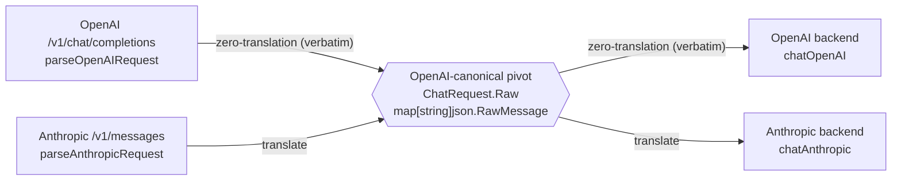

# ADR-0017: Canonical internal representation is the OpenAI-shaped pivot

- **Status:** Accepted
- **Date:** 2026-06-28
- **Deciders:** Matthew Bucci

## Context

[ADR-0016](0016-multi-protocol.md) decided that a single **canonical internal
model** sits between the inbound (consumer) and outbound (provider) adapters, but
it left the *shape* of that model abstract. With two consumer protocols and two
provider protocols, the open question is which one is the hub.

The code has already answered it. The hub is the **OpenAI Chat Completions JSON
shape**:

- `internal/router/contract.go` (`Backend` doc): the router "always hands it an
  OpenAI-canonical body and gets an OpenAI-shaped response back"; `ResponseSink`
  consumes "OpenAI-canonical" output and SSE events. The router and the selectors
  only ever see OpenAI.
- `internal/model/request.go` (`ChatRequest.Raw`): `Raw` is "the inbound body
  decoded into the OpenAI-canonical field map (unknown fields preserved)" — typed
  `map[string]json.RawMessage`, not a struct. For an OpenAI consumer it is the
  verbatim inbound body; for an Anthropic consumer it is the inbound adapter's
  translation into OpenAI shape.
- `internal/server/openai.go` `parseOpenAIRequest` decodes the body straight into
  that field map (zero translation), while `internal/server/anthropic.go`
  `parseAnthropicRequest` *builds* the OpenAI shape (system field → system-role
  message, `stop_sequences` → `stop`, content blocks → OpenAI parts).
- `internal/backend/client.go` `Chat` dispatches an OpenAI provider verbatim, but
  an Anthropic provider goes through `chatAnthropic` (`internal/backend/anthropic.go`),
  which does OpenAI → Anthropic on the way out and Anthropic → OpenAI on the reply.
- `internal/router/fusion.go` `buildFusionBody` synthesizes its panel/judge/
  synthesis sub-requests directly as OpenAI chat-completions bodies.

Naming the pivot explicitly closes the gap [ADR-0016](0016-multi-protocol.md)
left, ties the representation to the unknown-field-preserving discipline of
[ADR-0001](0001-transparent-openai-passthrough.md), and exposes a routing
asymmetry worth recording.

## Decision

The single internal/pivot representation is the **OpenAI Chat Completions JSON
shape**, held as a `map[string]json.RawMessage` field map that preserves unknown
fields ([ADR-0001](0001-transparent-openai-passthrough.md)) — never a typed,
lossy struct. Translation is **hub-and-spoke**: every consumer protocol is
translated *into* the OpenAI pivot at the inbound edge, and every provider
protocol is translated *out of* it at the outbound edge. `internal/router` and
the selectors operate only on the pivot ([ADR-0003](0003-layered-architecture.md)).

### The asymmetry

Because the pivot *is* the OpenAI shape, the two protocols are not symmetric:

| Path | Inbound edge | Outbound edge | Translations |
|------|--------------|---------------|--------------|
| OpenAI → OpenAI | verbatim | verbatim | **0** |
| OpenAI → Anthropic | verbatim | translate | 1 |
| Anthropic → OpenAI | translate | verbatim | 1 |
| Anthropic → Anthropic | translate | translate | **2** |

OpenAI consumers riding OpenAI backends pay nothing; the body flows through the
pivot untouched ([ADR-0001](0001-transparent-openai-passthrough.md)). An
**Anthropic** request pays translation on *both* edges even when it lands on an
Anthropic backend — the round trip Anthropic → OpenAI → Anthropic is both
wasteful and lossy (provider extras such as `tools`, `tool_choice`, `top_k`,
`metadata`, `cache_control` cannot survive the OpenAI intermediary). That
double-translation cost on the same-protocol Anthropic path is the motivation for
the native relay, which keeps the consumer's original bytes (`ChatRequest.ConsumerBody`)
and bypasses the pivot; it is specified in [ADR-0018](0018-native-same-protocol-relay.md).

## Consequences

**Positive**
- The router, selectors, fusion, and streaming logic are written against exactly
  one shape, not N², regardless of how many protocols the edges grow.
- The pivot inherits [ADR-0001](0001-transparent-openai-passthrough.md) fidelity
  for free: OpenAI ↔ OpenAI is byte-transparent because the field map preserves
  unknown fields rather than re-encoding through a struct.
- New OpenAI-shaped fields require no router changes; only the non-OpenAI edge
  adapters ever need translation work.

**Negative / trade-offs**
- The choice privileges OpenAI: every Anthropic request pays at least one
  translation, and same-protocol Anthropic pays two — accepted, and mitigated by
  the native relay ([ADR-0018](0018-native-same-protocol-relay.md)).
- The pivot is only as rich as the OpenAI schema; provider-specific fields with no
  OpenAI equivalent are dropped on any path that traverses it (best-effort,
  [ADR-0016](0016-multi-protocol.md)).

## Compliance

- **MUST** treat the OpenAI Chat Completions JSON shape as the single canonical /
  pivot representation; `internal/router` and the selectors **MUST** operate only
  on it and never on a provider-native body.
- **MUST** hold the canonical body as an unknown-field-preserving field map
  (`map[string]json.RawMessage`), never a struct that discards unrecognized JSON
  fields (consistent with [ADR-0001](0001-transparent-openai-passthrough.md)).
- **MUST** confine all OpenAI ↔ Anthropic translation to the edge adapters —
  `internal/server` inbound and `internal/backend` outbound — and **MUST NOT**
  perform protocol translation in `internal/router`
  ([ADR-0003](0003-layered-architecture.md), [ADR-0016](0016-multi-protocol.md)).
- **MUST** construct router-synthesized sub-requests (e.g. fusion panel/judge/
  synthesis bodies) in the OpenAI-canonical shape.
- **SHOULD** document the OpenAI ↔ OpenAI zero-translation versus Anthropic
  dual-edge-translation asymmetry as the rationale for the same-protocol native
  relay path ([ADR-0018](0018-native-same-protocol-relay.md)).
- **MAY** carry the consumer's original bytes alongside the pivot to enable that
  native relay; when present they bypass the pivot rather than replace it.
</content>
</invoke>
