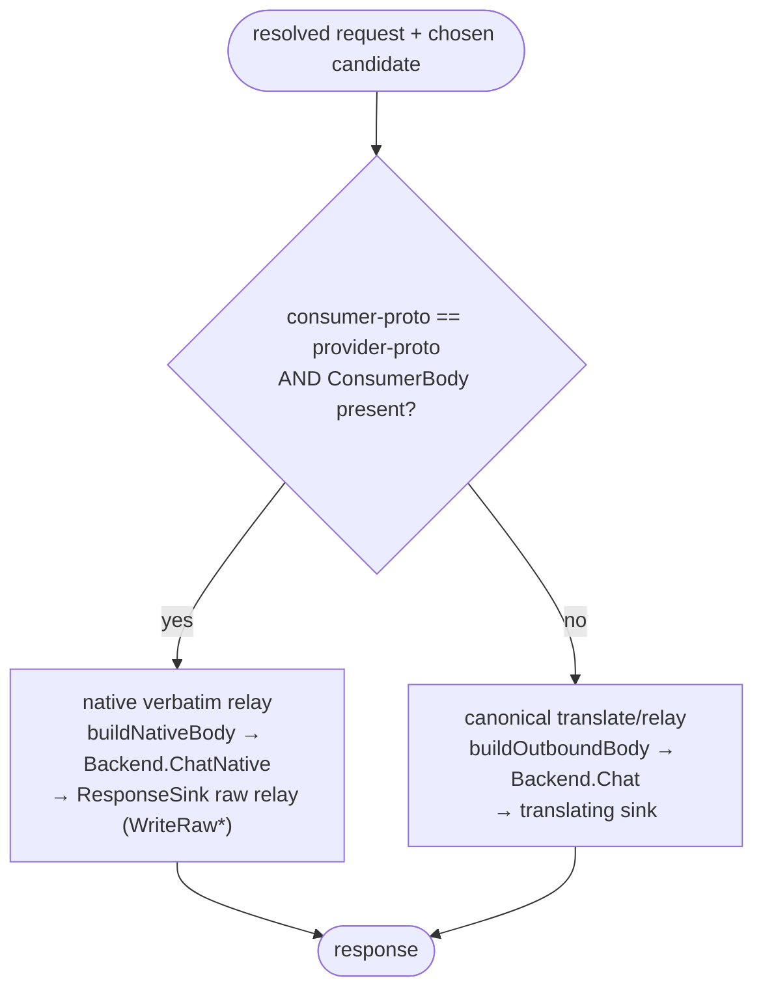

# ADR-0018: Native same-protocol relay

- **Status:** Accepted
- **Date:** 2026-06-28
- **Deciders:** Matthew Bucci

## Context

[ADR-0016](0016-multi-protocol.md) promises **Anthropic → Anthropic = full
fidelity** via a same-protocol passthrough. The OpenAI pivot
([ADR-0017](0017-canonical-openai-pivot.md)) makes the canonical model the router
operates on (`ChatRequest.Raw`) strictly **OpenAI-shaped**: for an Anthropic
consumer the inbound adapter (`internal/server/anthropic.go`
`parseAnthropicRequest`) translates the Messages body into OpenAI shape, and
`anthropicSink` translates the OpenAI-canonical reply back to Anthropic on the
way out.

Those two facts collide. Without a dedicated path, an Anthropic → Anthropic
request would be translated **Anthropic → OpenAI** (inbound) then
**OpenAI → Anthropic** (outbound) — a double translation through a lossy
intermediate. The canonical `Raw` carries only `model`, `stream`, `max_tokens`,
`temperature`, `top_p`, `stop`, `messages`, and `system`; it models none of
`tools`, `tool_choice`, `top_k`, `metadata`, or `cache_control`, which would be
**silently dropped**, breaking ADR-0016's promise.

The original bytes survive, though. `ChatRequest.ConsumerBody`
(`internal/model/request.go`) holds the inbound body byte-for-byte in the
consumer's own protocol shape. When the chosen backend speaks the consumer's
protocol, those bytes can be forwarded verbatim instead of the lossy canonical
`Raw`.

An earlier iteration hid this behind **optional capability interfaces**
(`nativeRelayer` / `rawRelaySink`) discovered by structural type assertion, to
avoid widening the core contracts. A code review found that pattern to be
**single-implementation decoration**: there is exactly one `Backend`
(`*backend.Client`), and the real sinks always implement the raw methods, so the
assertion only ever failed for test fakes and the "fall back when the capability
is absent" branch could never trigger in production. An interface — or an
optional capability reached by assertion — earns its keep only when there is a
real second implementation or a real polymorphic decision behind it. This had
neither, so the indirection was removed.

## Decision

Native same-protocol relay is a **first-class part of the core interfaces**, not
an optional capability. The verbatim path is chosen by an explicit **gate on the
request and chosen candidate**, not by capability discovery.

- **First-class methods.** `Backend.ChatNative(ctx, body, stream)` and the
  `ResponseSink` raw-relay methods (`WriteRawResponse` / `StartRawStream` /
  `WriteRawChunk`) are declared on the **required** `router.Backend` and
  `router.ResponseSink` interfaces (`internal/router/contract.go`). Every backend
  and every sink implements them and the compiler enforces it; there is no
  `nativeRelayer` / `rawRelaySink` assertion and no runtime capability fallback.
- **Per-candidate gate.** `nativeRelayFor(req, be)` (`internal/router/proxy.go`)
  returns `native = true` only when `req.Consumer == ProtocolAnthropic`,
  `be.Protocol() == req.Consumer`, and `len(req.ConsumerBody) > 0`. It is
  evaluated **per candidate**, so a failover sequence may mix native and
  canonical hops (e.g. an Anthropic backend, then an OpenAI fallback).
  `preferSameProtocol` orders same-protocol candidates first (except under
  `pareto`, whose cost order is authoritative), so the native path is taken when a
  same-protocol backend exists; a `false` result simply uses the canonical
  translate/relay path.
- **Outbound body.** `buildNativeBody` decodes `ConsumerBody` and applies
  `patchOutboundBody` — the **same surgical map-patch** as the canonical
  `buildOutboundBody`: copy every field, rewrite only `model`, strip `plugins`
  ([ADR-0001](0001-transparent-openai-passthrough.md)). Provider-specific fields
  stay byte-intact.
- **Native dispatch.** `Client.ChatNative` (`internal/backend/client.go`) POSTs
  the body to the provider's native Anthropic endpoint (`/messages`) with
  `x-api-key` + `anthropic-version`, performs **no** request or response
  translation, and returns the reply verbatim. In-flight accounting, per-call
  timeouts, and the streaming idle guard match `Chat` exactly.
- **Verbatim relay.** `handleNativeUnaryResponse` and
  `handleNativeStreamResponse` (with `relayRawStream`) push the provider's bytes
  through the sink's raw-relay methods with no protocol translation and no SSE
  reframing. Upstream status and `Content-Type` are preserved; the Anthropic
  `event:`/`data:` framing reaches the consumer's SDK unchanged.
- **Failover unchanged.** The native handlers apply the same pre-first-byte rules
  as the translating path: `isRetryableStatus` (502/503/504) fails over and
  fast-re-probes via `suspectBackend`; a non-retryable non-2xx is relayed as a
  unary error; once `StartRawStream` commits the SSE headers, failover is
  impossible ([ADR-0006](0006-routing-and-failover.md),
  [ADR-0007](0007-streaming.md)).

The path is currently **Anthropic-only**. OpenAI → OpenAI already gets byte
fidelity from the ordinary `Chat` verbatim relay, so it needs no native branch.

## Consequences

**Positive**
- ADR-0016's Anthropic → Anthropic full-fidelity promise is delivered: `tools`,
  `tool_choice`, `top_k`, `metadata`, and `cache_control` survive intact rather
  than being dropped by a double translation.
- First-class methods are **compiler-enforced**: a backend or sink that omits the
  native path fails to build, instead of silently degrading to the lossy path and
  being caught (if at all) only by a test. The gate decides native-vs-canonical;
  no dead "capability absent" branch exists to reason about.
- The relay is verbatim — constant-memory streaming, lower latency, fewer
  translation bugs on the hot same-protocol pairing — and `patchOutboundBody` is
  shared with the canonical path, so "rewrite model, strip plugins" lives once.

**Negative / trade-offs**
- A second relay path (native unary/stream handlers mirroring the canonical ones)
  is more surface to maintain and keep in lock-step on failover semantics. If the
  native path grows further, that is the signal to promote it to its own
  `Strategy` ([ADR-0006](0006-routing-and-failover.md)) rather than add branches.
- Every `Backend`/`ResponseSink` — including test fakes — must implement the
  native methods. For the OpenAI-shaped sink the raw methods delegate to its
  ordinary verbatim relay, so the cost is small and explicit.
- The native path bypasses the canonical usage parser and reads accounting via
  `parseAnthropicUsage` (`input_tokens`/`output_tokens`), a separate code path to
  keep correct.

## Compliance

- The router **MUST** take the native relay path when the consumer protocol
  equals the chosen provider protocol **and** the original `ConsumerBody` bytes
  are present, forwarding those bytes with only `model` rewritten and `plugins`
  stripped — the **same** surgical patch (`patchOutboundBody`) as the canonical
  path. No other field may be added, removed, or reordered semantically.
- The native relay **MUST** be exposed as first-class methods of the **required**
  `Backend` (`ChatNative`) and `ResponseSink` (`WriteRawResponse` /
  `StartRawStream` / `WriteRawChunk`) interfaces, and native-vs-canonical
  selection **MUST** be made by the `nativeRelayFor` gate (protocol +
  `ConsumerBody`), **not** by structural capability discovery. The decision
  **MUST** be made per candidate, so a failover sequence may mix native and
  canonical hops.
- On this path the router **MUST** relay the provider's native unary and SSE
  responses **verbatim** — no request or response translation, no SSE reframing —
  preserving the upstream HTTP status, `Content-Type`, and event framing.
- The native path **MUST** apply the same pre-first-byte failover rules as the
  translating path — retry on 502/503/504 with a suspect fast re-probe, no
  failover after the stream is committed ([ADR-0006](0006-routing-and-failover.md),
  [ADR-0007](0007-streaming.md)).
- The native path **MUST** stay scoped to the consumer == provider pairing;
  cross-protocol pairings **MUST** continue through the canonical translate/relay
  path ([ADR-0016](0016-multi-protocol.md)).
- Tests **SHOULD** assert that provider-specific fields (`tools`, `tool_choice`,
  `top_k`, `metadata`, `cache_control`) survive on the same-protocol native path
  and are lost on the cross-protocol path.
- The router **MAY** extend native relay to further same-protocol pairings;
  OpenAI → OpenAI needs no native branch because its canonical `Chat` relay is
  already byte-faithful ([ADR-0001](0001-transparent-openai-passthrough.md)).
