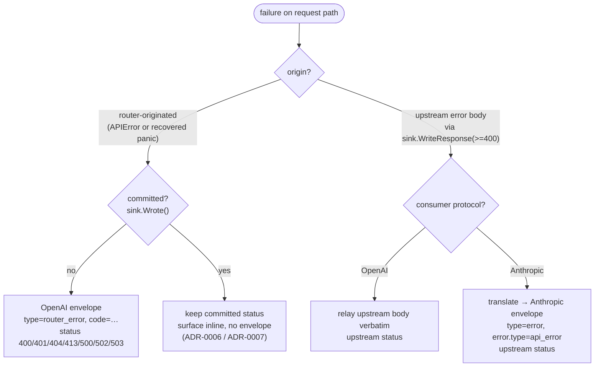

# ADR-0019: Error model — envelope, status/code taxonomy & the write-once contract

- **Status:** Accepted
- **Date:** 2026-06-28
- **Deciders:** Matthew Bucci

## Context

[ADR-0006](0006-routing-and-failover.md) only gestured at error behavior: a
three-row table mapping the routing outcomes `404` / `503` / `502`. The router
actually returns errors from several places — body limits, JSON decode, auth
([ADR-0009](0009-authentication.md)), routing, and recovered panics — and serves
two consumer protocols ([ADR-0016](0016-multi-protocol.md)). Three forces shape
the model:

1. **One envelope, one discriminator.** Consumers need a stable, machine-readable
   error shape regardless of which layer failed.
2. **Two origins.** A failure is either **router-originated** (the router itself
   rejects or cannot serve the request) or an **upstream error body** relayed
   through the response sink. They are shaped differently on purpose.
3. **Commit is a one-way door.** Once any response byte reaches the client the
   HTTP status is fixed; failover ([ADR-0006](0006-routing-and-failover.md)) and
   streaming ([ADR-0007](0007-streaming.md)) both depend on this. An error body
   may only be written *before* commit.

This ADR ratifies the contract `internal/model/errors.go` and `internal/server`
already implement.

## Decision

### Envelope

Router-originated errors render as the OpenAI error envelope via
`(*APIError).Body()`:

```json
{ "error": { "message": "…", "type": "router_error", "code": "model_not_found" } }
```

The `type` field is the **constant** `"router_error"` for *every*
router-originated error; the per-class discriminator lives in **`code`**. (This
inverts OpenAI's convention of putting the class in `type`, but it is uniform and
audit-friendly.) `writeAPIError` sets `Content-Type: application/json`, writes the
`APIError.Status`, then the body. A marshal failure — unreachable for these
plain-string fields — falls back to a hard-coded `internal` envelope.

### Status / code taxonomy

| Status | `code` | Constructor / site | Raised when |
|--------|--------|--------------------|-------------|
| 400 | `invalid_request_error` | `ErrBadRequest` | unparseable/aborted body, bad inbound JSON |
| 401 | `unauthorized` | `authed` middleware ([ADR-0009](0009-authentication.md)) | accepted tokens configured, none matched |
| 404 | `model_not_found` | `ErrModelNotFound` | name is neither a known alias nor an upstream id |
| 413 | `request_too_large` | `bodyReadError` | body exceeds the configured `maxBodySize` ([ADR-0008](0008-multimodal-and-large-bodies.md)) |
| 500 | `internal_error` | panic recovery in `handleChat` | recovered panic, response uncommitted ([ADR-0015](0015-code-style.md)) |
| 502 | `upstream_unavailable` | `ErrUpstreamUnavailable` | all candidate backends failed; also the fallback for any non-`APIError` escaping `Route` |
| 503 | `no_healthy_backend` | `ErrNoHealthyBackend` | model is known but no serving backend is healthy |

Only a `*model.APIError` escaping `Route` is part of the contract; any other
error is coerced to `502 upstream_unavailable`.

### The write-once contract

`handleChat` emits a router error body **only while `!sink.Wrote()`** (the gates
at `server.go:113` panic recovery and `server.go:164` route error). After the
sink has committed — a unary `WriteResponse`, a started stream, or any emitted
byte — the committed status stands and the failure is surfaced **inline** by the
strategy (mid-stream error event or a closed stream), never rewritten into an
envelope ([ADR-0006](0006-routing-and-failover.md),
[ADR-0007](0007-streaming.md)). The panic recovery is the floor of this rule: it
maps a recovered panic to `500` and writes the envelope **only** when
`sink == nil || !sink.Wrote()`.

### The deliberate asymmetry (router vs upstream)

The two origins are shaped differently, and this is **ratified**, not a bug:

- **Router-originated** errors always take `writeAPIError` → the OpenAI envelope
  above, **even on the Anthropic endpoint** (`/v1/messages`). A
  `model_not_found` for an Anthropic SDK client is still
  `{error:{…,type:"router_error",…}}`.
- **Upstream error bodies** flow through the response sink and are translated to
  the *consumer's* shape: the OpenAI sink relays the upstream body verbatim;
  `anthropicSink.WriteResponse` with `status >= 400` rewrites it via
  `anthropicErrorBody` into the Anthropic error envelope
  `{type:"error",error:{type:"api_error",message}}`, extracting the upstream
  `error.message`.

So a cross-protocol consumer can see two different error shapes depending on
whether the router or a backend produced the failure. We accept this for now: the
router-originated set is small, well-known, and uniform, and converging it onto
the Anthropic envelope is a localized future change (`writeAPIError` would need
the consumer protocol). The asymmetry is documented here as a known wart rather
than left implicit.



## Consequences

**Positive**
- One envelope and a small, fixed `code` taxonomy: predictable for clients and
  for the [`/engineering-audit`](README.md) skill.
- The write-once gate makes failover and streaming safe by construction — no
  half-written body can be "corrected" into an error document.
- The request path cannot crash the process: panics become a `500` (or are
  swallowed once committed) and still emit exactly one log/metrics record
  ([ADR-0011](0011-observability.md)).

**Negative / trade-offs**
- Cross-protocol consumers see **two** error shapes (router vs upstream). Ratified,
  not yet unified.
- `type` is a constant `"router_error"`, so OpenAI clients keying off `type`'s
  conventional class names must read `code` instead.
- After commit, the only signal of an upstream failure is inline/stream-level,
  which is harder for naive clients to detect than a status code.

## Compliance

- **MUST** render router-originated errors as the OpenAI envelope
  `{error:{message,type,code}}` with `type` set to the constant `"router_error"`
  and the class carried in `code`.
- **MUST** use the taxonomy: `400 invalid_request_error`, `401 unauthorized`
  ([ADR-0009](0009-authentication.md)), `404 model_not_found`,
  `413 request_too_large`, `500 internal_error`, `502 upstream_unavailable`,
  `503 no_healthy_backend`.
- **MUST** coerce any non-`APIError` escaping `Route` to `502 upstream_unavailable`.
- **MUST** emit a router error body only while no response byte is committed
  (`!sink.Wrote()`); after commit, keep the committed status and surface the
  failure inline ([ADR-0006](0006-routing-and-failover.md),
  [ADR-0007](0007-streaming.md)).
- **MUST** translate upstream error bodies into the **consumer's** envelope on the
  sink path: verbatim for an OpenAI consumer, Anthropic error envelope for an
  Anthropic consumer ([ADR-0016](0016-multi-protocol.md)).
- **MUST** treat router-originated errors on the Anthropic endpoint as currently
  OpenAI-shaped — the asymmetry is **ratified**; changing it requires revising
  this ADR first.
- **MUST** keep the request path panic-safe, mapping a recovered panic to `500`
  **only** when the response is uncommitted ([ADR-0015](0015-code-style.md)).
- **SHOULD** keep error `message` strings human-readable and free of secrets,
  stack traces, or internal addresses ([ADR-0009](0009-authentication.md),
  [ADR-0011](0011-observability.md)).
- **MAY**, in a future revision, converge router-originated errors on the
  Anthropic endpoint onto the Anthropic error envelope.
