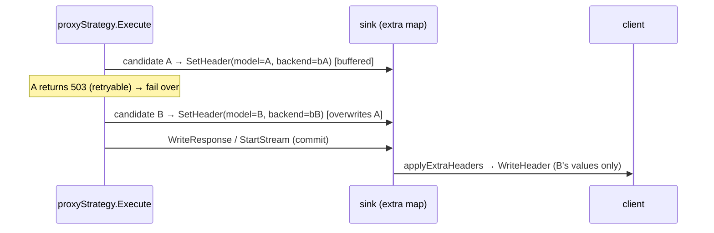

# ADR-0020: Response provenance headers (X-Router-Model / X-Router-Backend)

- **Status:** Accepted
- **Date:** 2026-06-28
- **Deciders:** Matthew Bucci

## Context

When an alias fans out to a pool ([ADR-0013](0013-pareto-routing.md)) or a
request fails over to a fallback ([ADR-0006](0006-routing-and-failover.md)), the
caller has no way to tell *which* concrete model and backend actually served the
response: the inbound `model` is an alias, and the upstream's echoed `model`
field is provider-controlled (it may be a short name, may be absent, or may not
match the configured id at all). Agents want to see the real routing decision —
as OpenRouter surfaces it.

[ADR-0013](0013-pareto-routing.md) described this annotation, but inaccurately:

- It framed provenance as **pareto-only**. In code it is **always on** for every
  proxy path — `round_robin`, `pareto`, and bare direct-id resolution alike.
- It claimed the decision is conveyed by **mutating the response `model` field**
  plus an `x-router-model` / `metadata.router` marker. In code the router never
  touches the JSON body; it emits HTTP **headers** only.
- It documented only `X-Router-Model`. The implementation also emits
  **`X-Router-Backend`**, which was undocumented.

This ADR makes the provenance mechanism authoritative and corrects that drift.

## Decision

The proxy strategy annotates every committed response with two headers carrying
the resolved routing decision, independent of any upstream echo:

| Header | Value | Source |
|--------|-------|--------|
| `X-Router-Model` | the **resolved upstream model id** (not the alias) | `cand.Model` |
| `X-Router-Backend` | the **chosen backend name** | `cand.Backend` |

`internal/router/proxy.go` sets both via `sink.SetHeader` (lines 142-143)
immediately after a candidate's upstream call returns a response, on every
attempt and on all four relay paths (unary/stream, translating/native-raw). A
pure connect error short-circuits before this point, so only a candidate that
actually produced an HTTP response stamps headers.

`SetHeader` **buffers**, it does not write (`ResponseSink` contract,
`internal/router/contract.go` lines 48-54). Each consumer-protocol sink keeps the
pairs in an `extra` map and flushes them through `applyExtraHeaders` **before
`WriteHeader`** at every commit point:

- `openaiSink` — `WriteResponse`, `StartStream` (`internal/server/sink.go`).
- `anthropicSink` — `WriteResponse` and `StartStream` on the translating path,
  **and** `WriteRawResponse` and `StartRawStream` on the native passthrough path
  ([ADR-0016](0016-multi-protocol.md), `internal/server/anthropic.go`).

`applyExtraHeaders` uses `http.Header.Set`, and repeated `SetHeader` calls
overwrite the `extra` map per key. So across a failover sequence each new
candidate overwrites the previous candidate's buffered values, and only the
candidate that commits the response (the one that reaches `WriteResponse` /
`StartStream` / their raw variants) contributes headers — never an appended
union. `internal/server/router_headers_test.go` asserts the resolved id (not the
alias) and the backend name on both the OpenAI and Anthropic sinks.

### Fusion

`fusionStrategy.runSynthesis` (`internal/router/fusion.go`) commits through the
same sink (`WriteResponse` / `relayStream`) and **also** stamps the provenance
headers — `SetHeader("X-Router-Model", plan.Synthesis.Model)` and
`SetHeader("X-Router-Backend", plan.Synthesis.Backend)` — after the synthesis call
returns and before every commit, so a fusion response carries the same
`(model, backend)` signal as a proxy response. There is **no** `metadata.router`
body marker: provenance is header-only (the body is relayed verbatim), and
[ADR-0014](0014-fusion-routing.md) reflects this.

## Consequences

**Positive**
- Callers always see the concrete `(model, backend)` that served them, even after
  failover or pool selection — for free, with no body parsing.
- Provenance is body-agnostic: it survives verbatim OpenAI relay, cross-protocol
  Anthropic translation, and native Anthropic passthrough identically, and never
  perturbs the response JSON or token accounting.
- One buffer-then-flush mechanism makes "only the committing candidate wins"
  fall out naturally from map overwrite + `header.Set`.

**Negative / trade-offs**
- Header-only provenance is invisible to clients that read just the JSON body
  (the original — now corrected — ADR-0013 expectation).
- The model/backend a fusion response reports are the *configured* synthesis
  target (fusion has a fixed synthesis stage), not a per-request pool choice as in
  pareto.

## Compliance

- The proxy strategy **MUST** set `X-Router-Model` (the resolved upstream model
  id, **not** the alias) and `X-Router-Backend` (the chosen backend name) on
  every committed proxy response, independent of any upstream `model` echo, for
  `round_robin`, `pareto`, and direct-id resolution alike.
- Provenance headers **MUST** be buffered via `ResponseSink.SetHeader` and
  emitted at commit time, **before** `WriteHeader`, on every consumer-protocol
  sink and every commit path (unary and streaming, translating and native-raw).
- Across a failover sequence the headers **MUST** overwrite, not append, so that
  only the values of the candidate that commits the response are sent.
- The router **MUST NOT** mutate the response JSON body to convey provenance
  (this corrects [ADR-0013](0013-pareto-routing.md)'s response-`model` /
  `metadata.router` claim; provenance is HTTP-header only).
- Fusion **MUST** set the same `X-Router-Model` / `X-Router-Backend` headers on
  its synthesis response (the synthesis model and backend), consistent with the
  proxy paths. Provenance is header-only: the router **MUST NOT** write a
  `metadata.router` body marker, and [ADR-0014](0014-fusion-routing.md) reflects
  this.
