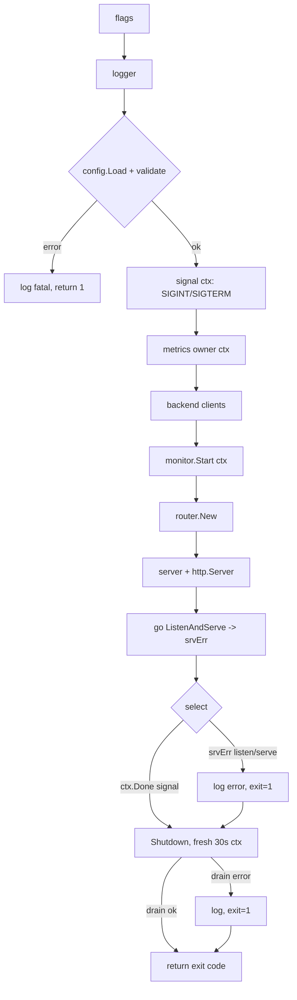

# ADR-0021: Process lifecycle — startup ordering, signals, fail-fast bind & graceful shutdown

- **Status:** Accepted
- **Date:** 2026-06-28
- **Deciders:** Matthew Bucci

## Context

The composition root ([ADR-0003](0003-layered-architecture.md)) is the only place
that constructs concretes and wires layers, and it validates config before
listening ([ADR-0010](0010-configuration.md)). Those ADRs touch the *runtime
lifecycle* only at the edges. The actual sequence — how the process boots, how
background goroutines are bounded, how a bind failure is surfaced, and how a
signal drains in-flight work — lives in `cmd/router/main.go` and deserves its own
normative contract.

Three forces shape it:

- **`os.Exit` skips `defer`.** A naive `main` that calls `os.Exit` on error never
  runs deferred cleanup (`stop`, `cancel`). We need a single exit point that
  still honors deferred teardown.
- **Goroutine lifetimes must be bounded.** The metrics owner and the health/
  discovery loop are long-lived background goroutines ([ADR-0005](0005-backend-discovery-and-health.md),
  [ADR-0015](0015-code-style.md)). Without one root cancellation they leak on exit.
- **Shutdown must not drop work.** Streaming relays ([ADR-0007](0007-streaming.md))
  and ordinary requests are in flight when SIGTERM lands. Killing the listener
  immediately truncates streams; waiting forever hangs the process.

## Decision

`main` is one line — `os.Exit(run())` — and **`run` returns the exit code**.
All wiring and teardown live in `run`, so every `defer` (`stop`, `cancel`)
executes before the process exits.

`run` follows a **strict, linear startup order**, each step a precondition for
the next:

| # | Step | Notes |
|---|------|-------|
| 1 | parse **flags** | `--config` (required), `--log-level` |
| 2 | build **logger** | `--log-level` parsed before any log line is emitted |
| 3 | `config.Load` + **validate** | fatal & non-zero on error, **before any listener** ([ADR-0010](0010-configuration.md)) |
| 4 | **signal context** | `signal.NotifyContext(ctx, os.Interrupt, syscall.SIGTERM)`; `defer stop()` |
| 5 | **metrics** | `observability.New(ctx)` — owner goroutine bound to root ctx |
| 6 | **backend clients** | one `*backend.Client` per upstream |
| 7 | `monitor.Start(ctx)` | health/discovery loop bound to root ctx ([ADR-0005](0005-backend-discovery-and-health.md)) |
| 8 | **router** | `router.New(...)` over the structural backend views ([ADR-0003](0003-layered-architecture.md)) |
| 9 | **server** | `server.New(...)` → `http.Server{Addr, Handler}` |
| 10 | `ListenAndServe` | in a background goroutine; errors land on `srvErr` |

The **root context** comes from `signal.NotifyContext(context.Background(),
os.Interrupt, syscall.SIGTERM)` and is passed into the metrics owner and the
monitor, so a single SIGINT/SIGTERM cancels **every** background goroutine
([ADR-0015](0015-code-style.md)).

`ListenAndServe` runs in its own goroutine; the main goroutine then blocks on a
two-way `select`:

- **signal** (`ctx.Done()`) → graceful drain.
- **bind/serve error** (`srvErr`, buffered size 1) → the failure is **fatal**;
  set exit code 1. `http.ErrServerClosed` is filtered out, since that is the
  normal result of `Shutdown`.

Either branch falls through to a **graceful shutdown** on a **fresh 30s
context** (`shutdownTimeout`). It is built from `context.Background()` — *not*
the root ctx, which is already cancelled once a signal arrives — so
`httpServer.Shutdown` actually has time to stop accepting new connections and
drain in-flight requests, including streams ([ADR-0007](0007-streaming.md)), up
to the bound. A drain error also yields a non-zero exit.

## Consequences

**Positive**
- One exit point; deferred `stop`/`cancel` always run — no leaked signal handler
  or context.
- A single root context bounds every background goroutine; clean teardown.
- Misconfiguration and bind failures abort loudly and non-zero before serving.
- Signals drain real work (streams included) instead of cutting connections.

**Negative / trade-offs**
- A wedged in-flight request can stall shutdown up to 30s before the listener is
  forced closed.
- The strict linear order is rigid: new subsystems must be slotted in
  deliberately, with their goroutine bound to the root ctx.
- `shutdownTimeout` is a compile-time constant, not operator-tunable in v1.

## Compliance

- **MUST** install a root `context.Context` cancelled on `SIGINT`/`SIGTERM`
  (`signal.NotifyContext`) and bind every background goroutine's lifetime — the
  metrics owner and the health/discovery loop — to it ([ADR-0015](0015-code-style.md),
  [ADR-0005](0005-backend-discovery-and-health.md)).
- **MUST** fully load and validate configuration **before** binding the listener,
  and **exit non-zero** on failure ([ADR-0010](0010-configuration.md)).
- **MUST** treat a listener/serve error (delivered over `srvErr`) as **fatal**
  and exit non-zero, ignoring `http.ErrServerClosed`.
- **MUST** perform graceful shutdown on signal — stop accepting new connections
  and drain in-flight requests, **including streams** ([ADR-0007](0007-streaming.md)),
  up to a bounded `shutdownTimeout` — using a context **independent of the
  already-cancelled root context**.
- **SHOULD** keep `main` a thin `os.Exit(run())` wrapper so `os.Exit` is called
  **only after** deferred cleanup has run (the `run()`/`main` split).
- **MAY** make `shutdownTimeout` operator-configurable in a future revision; v1
  fixes it as a constant.
