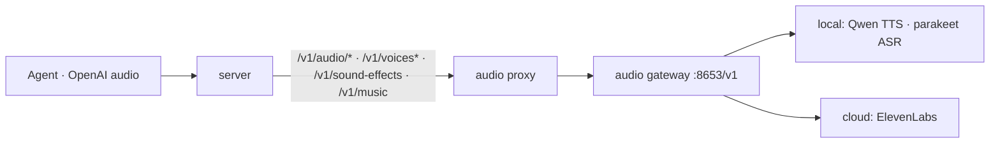

# ADR-0022: Audio passthrough — TTS, transcription, voices & cloud audio

- **Status:** Accepted
- **Date:** 2026-06-28
- **Deciders:** Matthew Bucci

## Context

The fleet runs an **audio gateway** (one service, port 8653) that fronts the whole
audio surface behind a single OpenAI-shaped API:

- **Speech (TTS)** — `POST /v1/audio/speech`, local-first (Qwen), `engine`
  `auto`|`local`|`elevenlabs` with cloud fallback. Returns audio bytes.
- **Transcription (ASR)** — `POST /v1/audio/transcriptions`, local parakeet,
  multipart upload of any container (mp3/m4a/mp4/mkv/webm/… via ffmpeg).
- **Voice management** — `GET`/`POST /v1/voices`, `DELETE /v1/voices/{id}`.
- **Cloud audio** (what the GPU can't do, ElevenLabs) — `POST /v1/audio/isolation`
  (multipart cleanup), `POST /v1/sound-effects` (json→audio),
  `POST /v1/music` (json→audio).
- **Meta** — its own `GET /v1/models` (engine list) and `GET /healthz`.

The gateway does its own engine selection, ffmpeg transcoding, and ElevenLabs
fallback; it authenticates with a bearer token. Agents want the same single stable
LAN endpoint for this that they already get for chat.

Audio does **not** fit the chat machinery, and forcing it through would break that
machinery's invariants:

1. **Different request/response shapes.** Speech/effects/music return **binary**
   audio. Transcription and isolation take a **multipart upload**. None is the
   chat JSON-in/JSON-out shape, and the speech/effects requests carry no chat
   `model` field.
2. **No canonical pivot.** [ADR-0016](0016-multi-protocol.md) /
   [ADR-0017](0017-canonical-openai-pivot.md) pivot every request through a
   canonical **chat** model with translating sinks. There is nothing to translate
   here, and no Anthropic audio API to translate *to*.
3. **Not discoverable as a chat backend.** [ADR-0002](0002-engine-agnostic-backends.md)
   and [ADR-0005](0005-backend-discovery-and-health.md) require every entry in
   `backends[]` to serve `GET /v1/models` and `POST /v1/chat/completions` and to be
   health-probed via `/v1/models`. The gateway's `/v1/models` lists audio engines,
   not chat models.
4. **Big, slow, streamed bodies.** A long transcription upload or a long TTS/music
   render must stream end-to-end without an overall deadline
   ([ADR-0007](0007-streaming.md)) and without buffering beyond the inbound cap
   ([ADR-0008](0008-multimodal-and-large-bodies.md)).

## Decision

Add a **standalone audio passthrough** that runs **parallel** to the chat router:
a single, transparent reverse proxy to the gateway. It reuses the inbound trust
boundary but **bypasses `internal/router` and the canonical chat model entirely**.
The gateway remains the brain (engine choice, transcoding, fallback); the router is
a thin, faithful pipe in front of it.



### Configuration

A new optional `audio:` block — a single gateway target addressed by its base URL
(typically ending in `/v1`) with its own outbound credential
([ADR-0009](0009-authentication.md)):

```yaml
audio:
  base_url: http://192.168.2.179:8653/v1
  credentials: { api_key: ${VOICE_API_TOKEN} }
```

An empty/absent `base_url` means audio is **unconfigured**: every audio route is
left unregistered, so the paths return `404` ([ADR-0019](0019-error-model.md)).

### Routing table

Every route below is forwarded to `{audio.base_url}` + path, behind inbound auth.

| Inbound (authed)                         | Forwarded to             |
|------------------------------------------|--------------------------|
| `POST /v1/audio/speech`                  | gateway, same path       |
| `POST /v1/audio/transcriptions`          | gateway, same path       |
| `POST /v1/audio/isolation`               | gateway, same path       |
| `POST /v1/sound-effects`                 | gateway, same path       |
| `POST /v1/music`                         | gateway, same path       |
| `/v1/voices`, `/v1/voices/{id}` (all verbs) | gateway, same path    |

The `/v1/voices` subtree is registered **method-less** so list (`GET`), register
(`POST`), and delete (`DELETE /v1/voices/{id}`) all pass through without the router
enumerating verbs. The gateway's own meta endpoints (`GET /v1/models`,
`GET /healthz`) are **not** proxied — the router already serves its own
([ADR-0011](0011-observability.md)); audio engine listing/health stays a direct
gateway concern.

The inbound `/v1/<resource>` path is mapped onto the configured base path
(mirroring `backend.Client.url()`): base `…/v1` + `/audio/speech` →
`…/v1/audio/speech`. Query string, method, headers, and body are forwarded
verbatim.

### Transparency & transport

Built on the standard library's `net/http/httputil.ReverseProxy`
([ADR-0015](0015-code-style.md): standard-library-first). Request and response
bodies are forwarded **byte-for-byte and streamed** — binary audio out, chunked
output, and large multipart uploads in all pass through unmodified
([ADR-0001](0001-transparent-openai-passthrough.md)). `FlushInterval = -1` flushes
each write so streamed audio is not buffered. The transport sets a **dial**
timeout but **no overall request deadline** ([ADR-0007](0007-streaming.md)), since
a long render or transcription is slow like a stream.

### Credentials

The inbound consumer credential is verified and then **stripped** at the trust
boundary by the shared `authed` middleware ([ADR-0009](0009-authentication.md));
the proxy then injects the operator-owned outbound `Authorization: Bearer <token>`.
Nothing inbound leaks upstream.

### Errors & observability

Transport failures surface as the OpenAI error envelope
([ADR-0019](0019-error-model.md)): `502 upstream_unavailable`, or
`413 request_too_large` when the inbound body exceeds the cap
([ADR-0008](0008-multimodal-and-large-bodies.md)). Gateway-originated errors
(`400` bad input, `503` ElevenLabs key not set, etc.) are relayed verbatim. Each
audio request emits **exactly one** structured log line and **one** metrics record
([ADR-0011](0011-observability.md)), with `backend` set to `audio` and the path
distinguishing the endpoint.

### Health & readiness

The audio gateway is **independent** of the chat health snapshot. `/healthz`,
`/readyz`, and `/v1/models` on the router are unchanged and reflect only chat
backends; audio failures surface per-request (or via the gateway's own
`/healthz`). The gateway is **never** probed via `/v1/models`.

## Consequences

**Positive**
- The chat core's invariants (canonical pivot, `/v1/models` discovery, failover)
  are untouched; audio is additive and self-contained.
- True passthrough: any field/format/endpoint the gateway adds (new `engine`,
  `output_format`, future routes under the proxied prefixes) works without router
  changes.
- Streams and large uploads flow without buffering or an overall deadline.

**Negative / trade-offs**
- No failover, pareto, fusion, or `model`-alias routing for audio — one gateway.
  (The gateway already does engine selection and cloud fallback internally.)
- Audio health is not reflected in the router's `/readyz`; a dead gateway is only
  visible per-request or via the gateway's own `/healthz`.
- The router-originated error asymmetry of [ADR-0019](0019-error-model.md) applies
  (router errors are OpenAI-shaped), which is moot here as the surface is
  OpenAI-only.

## Compliance

- **MUST** serve audio via a transparent reverse proxy that **bypasses**
  `internal/router` and the canonical chat model
  ([ADR-0016](0016-multi-protocol.md), [ADR-0017](0017-canonical-openai-pivot.md)).
- **MUST** register audio routes only when the gateway is configured; otherwise the
  audio paths **MUST** `404` ([ADR-0019](0019-error-model.md)).
- **MUST** forward request and response bodies **streamed and byte-for-byte**, with
  no overall request deadline ([ADR-0001](0001-transparent-openai-passthrough.md),
  [ADR-0007](0007-streaming.md)).
- **MUST** enforce the inbound body cap and map an exceeded cap to
  `413 request_too_large` ([ADR-0008](0008-multimodal-and-large-bodies.md),
  [ADR-0019](0019-error-model.md)).
- **MUST** strip the inbound consumer credential and inject the operator-owned
  outbound credential ([ADR-0009](0009-authentication.md)).
- **MUST** surface router-side transport failures as the OpenAI error envelope
  (`502 upstream_unavailable`) and relay gateway-originated error bodies verbatim
  ([ADR-0019](0019-error-model.md)).
- **MUST** emit exactly one log line and one metrics record per audio request,
  tagged with `backend = audio` ([ADR-0011](0011-observability.md)).
- **MUST NOT** proxy the gateway's meta endpoints (`/v1/models`, `/healthz`) — the
  router serves its own — and **MUST NOT** probe the gateway via `/v1/models` or
  include it in the chat health snapshot or `/readyz`
  ([ADR-0002](0002-engine-agnostic-backends.md),
  [ADR-0005](0005-backend-discovery-and-health.md)).
- **MAY**, in a future revision, add multiple audio gateways, audio-specific
  health, or `model`-alias routing — each requires revising this ADR first.
