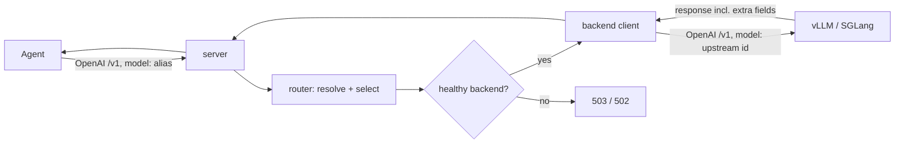

# Engineering Documentation — Architecture Decisions

This directory holds the **Architecture Decision Records (ADRs)** for
`simple-llm-router`. Each document captures one decision — the *context* that
forced it, the *decision* itself, its *consequences*, and the *compliance rules*
the codebase must follow as a result.

ADRs are the source of truth. They are normative: the
[`/engineering-audit`](../../.claude/skills/engineering-audit/SKILL.md) skill reads the
**Compliance** section of every ADR and dispatches a team of agents to audit the
code against those rules.

## The decisions

| ADR | Decision | Concerns |
|-----|----------|----------|
| [0001](0001-transparent-openai-passthrough.md) | Transparent OpenAI-compatible passthrough | API contract, fidelity |
| [0002](0002-engine-agnostic-backends.md) | Engine-agnostic backends over OpenAI `/v1` | vLLM, SGLang, portability |
| [0003](0003-layered-architecture.md) | Clean layered architecture & the dependency rule | package structure |
| [0004](0004-model-aliasing.md) | Friendly model aliasing & name resolution | usability, stability |
| [0005](0005-backend-discovery-and-health.md) | Backend discovery & health checking | availability |
| [0006](0006-routing-and-failover.md) | Routing, selection & failover | correctness, resilience |
| [0007](0007-streaming.md) | Streaming via SSE passthrough | latency, fidelity |
| [0008](0008-multimodal-and-large-bodies.md) | Multimodal content & large request bodies | images/audio/video |
| [0009](0009-authentication.md) | Authentication & the trust boundary | security |
| [0010](0010-configuration.md) | Configuration & validation | operability |
| [0011](0011-observability.md) | Observability: logging & metrics | operability |
| [0012](0012-testing.md) | Testing strategy | quality |
| [0013](0013-pareto-routing.md) | Pareto routing strategy (cheapest-good-enough) | cost/quality |
| [0014](0014-fusion-routing.md) | Fusion routing strategy (panel → judge → synthesis) | answer quality |
| [0015](0015-code-style.md) | Code style & concurrency conventions | maintainability |
| [0016](0016-multi-protocol.md) | Multi-protocol consumers & providers (OpenAI + Anthropic) | interoperability |
| [0017](0017-canonical-openai-pivot.md) | Canonical OpenAI-shaped pivot representation | internal model, fidelity |
| [0018](0018-native-same-protocol-relay.md) | Native same-protocol relay | fidelity, capability interfaces |
| [0019](0019-error-model.md) | Error model — envelope, taxonomy & write-once | API contract, correctness |
| [0020](0020-response-provenance-headers.md) | Response provenance headers | observability, traceability |
| [0021](0021-process-lifecycle.md) | Process lifecycle — startup, signals, graceful shutdown | operability |

## How a request flows (orientation)

The decisions above combine into this path. Read the ADRs for the *why*.

## ADR format

Every ADR uses the same shape:

- **Status** — Proposed / Accepted / Superseded.
- **Context** — the forces and constraints (often grounded in real backend
  behavior observed on the fleet).
- **Decision** — what we do, stated plainly.
- **Consequences** — the good and the bad we accept.
- **Compliance** — **MUST** / **SHOULD** / **MAY** rules ([RFC 2119](https://www.rfc-editor.org/rfc/rfc2119))
  the code is audited against.

To change a decision, edit its ADR first, then bring the code into line. The
docs lead; the code follows.
